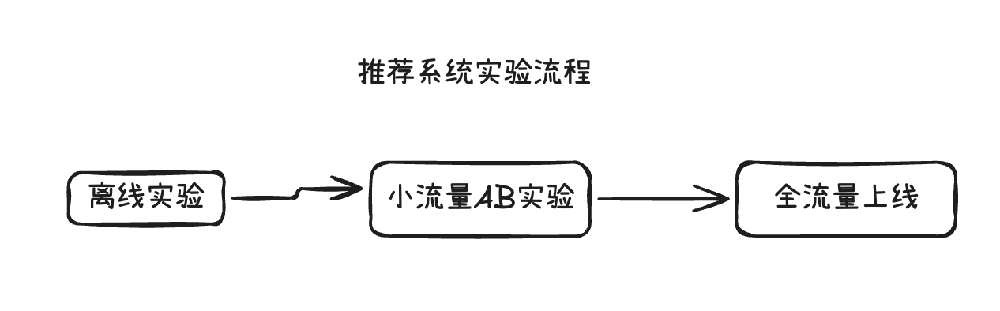

> [!info]
> 以小红书的推荐系统为例


推荐算法工作内容：优化模型、特征、推荐、系统


1. 召回：从数据库中快速取回一些笔记，例如调用几十条召回通道，每条召回通道取回几十到几百个笔记，共取回几千篇笔记，然后做去重和过滤
2. 排序
	1. 粗排：用机器学习模型预估用户对笔记的兴趣，保留分数最高的几百篇笔记，例用规模比较小的机器学习模型给几千篇笔记打分，按照分数做排序和截断，保留分数最高的几百篇笔记
	2. 精排：规模比较大的神经网络给几百篇笔记逐一打分，使用特征更多、模型规模更大、打分更准确
	3. 重排：考虑多样性，根据精排分数和多样性分数做多样性抽样，得到几十篇笔记，用规则把相似内容打散、插入广告和运营内容，得到最终展示的笔记

AB测试作用：
- 考察模型/策略对线上指标的影响
- 通过实验对比选取模型最优参数
AB测试基本思想：
1. 随机分桶：用哈希函数把用户ID映射成某个区间内的整数，然后把这些整数均匀随机分成b个桶（例如10个桶）
2. 分桶实验：每个桶做不同的实验，eg1号桶做实验1，2号桶做实验2，3号桶为对照组
3. 分桶指标：计算每个桶的业务指标，如DAU、人均使用推荐的时长等
4. 指标评估：如果某个实验组的指标显著优于对照组，说明对应的策略有效，值得推全（流量扩大到所有用户）
分层实验：
目标：解决线上同时开多个AB测试流量不够用的问题
解决办法：把实验分成很多层，如召回、粗排、精排等
实验思想：
- 同层互斥：如GNN召回实验占了召回层的4个桶，其他召回实验只能用剩余的6个桶，目的是避免一个用户同时被两个召回实验影响
- 不同层实验流量正交：每一层独立随机对用户做分桶，每一层都可以独立用100%的用户做实验，例如层A的1号桶的用户被随机打散到了层B的10个桶中

同层互斥的原因：
- 同层中同类的策略（如精排模型的两种结构）天然互斥，对于一个用户只能用其中一种。
- 同层中同类策略（例如添加两层召回通道）的效果可能相互增强或相互抵消。互斥可以避免同类策略相互干扰。
不同层正交的原因：同一个层的实验影响可能相互增强和相互抵消，不同层的实验影响大概率不会相互增强或相互抵消，所以允许同一个用户同时受两层实验的影响

## 参考文档
1. 王树森b站课程：https://www.bilibili.com/video/BV1FwXrBmEp4/?spm_id_from=333.1007.0.0&vd_source=eb8b7c6e7469cdcb996a41649e1220b0
2. 王树森个人网站：https://wangshusen.github.io/
# Excalidraw Data

## Text Elements
曝光 ^6BQIMRoJ

点击 ^u8wgC5Ie

滑动到底 ^ZYvivzVs

评论 ^2cr6uJpK

点赞 ^yZj45Bo8

收藏 ^hnxiqlU1

转发 ^uqkngG6u

推荐系统转化流程 ^ynt1Rkzi

离线实验 ^8nRb0ELd

小流量AB实验 ^cyVe5vAx

全流量上线 ^ayyAOsIW

推荐系统实验流程 ^v2JF5oDb

 推荐系统北极星指标 ^xlpQLRWP

用户规模 ^8Tu9DCef

消费 ^Q0XRUXzh

发布 ^lP9LYLY5

日活用户数（DAU） ^su01487i

月活用户数（MAU） ^bckrBzYB

人均使用推荐的时长 ^b2eDmTk8

人均阅读笔记的数量 ^krllXQOL

发布渗透率 ^ZdM6sGoX

人均发布量 ^95mJnmuJ

每一步都是推荐系统的特征 ^16j79SXN

推荐系统短期消费指标 ^WK1Qzjnf

点击率=点击次数/曝光次数 ^qM8eglbU

点赞率=点赞次数/点击次数 ^H212X8NB

收藏率=收藏次数/点击次数 ^g6xzgxcZ

阅读完成率=滑动到底次数/点击次数✖️f(笔记长度) ^9mmkXZea

仅关注短期消费指标的提升可能
导致竭泽而渔；提升推荐内容的
多样性对于提升用户粘性、提升
北极星指标的效果更好 ^XVOqzUdU

f(笔记长度)是对于笔记长度
的归一化函数 ^0vMLVhRm

推荐系统的链路 ^TXjfKze7

召回 ^EBDr6Vxq

粗排 ^ZQ9cc9k3

精排 ^cGQqDW3N

重排 ^KEZzd6vK

几亿笔记 ^ndmEIEdW

几千笔记 ^7c2pPcsp

几百笔记 ^GOvfGBku

几百笔记 ^mkobl7lK

几十笔记 ^QNlPmF4W

召回通道：协同过滤、
双塔模型、关注的作者等 ^agKapK0b

规模小的模型
快速打分 ^PQyO2pT9

规模比较大的模型
精细打分 ^KW5cDbc8

平衡计算量和准确率 ^uYrdumrF

做多样性抽样（MMR、DPP） ^3rwR66Um

笔记数据库 ^RJkn3uq1

最终要展示的笔记 ^QZ9oaop1

粗排、精排 ^kGULZa6g

用户特征 ^qcoeULuF

笔记特征 ^hVitXSV7

统计特征 ^k5EQdznA

神经网络 ^TcjmeiPV

点击率 ^fpnFj30t

点赞率 ^8jbhYOaS

收藏率 ^C1zskYmE

转发率 ^f1xAg3Y8

预估值 ^tHZIZkJw

排序分数 ^iLli8nch

规则打散相似笔记
插入广告、运营内容、根据生态要求
调整排序 ^L9ipeDXZ

%%
## Drawing
```json
{
	"type": "excalidraw",
	"version": 2,
	"source": "https://github.com/zsviczian/obsidian-excalidraw-plugin/releases/tag/2.22.3",
	"elements": [
		{
			"id": "Rvr7ufMS",
			"type": "rectangle",
			"x": 73.49609375,
			"y": 303.60546875,
			"width": 68.44140625,
			"height": 54.86328125,
			"angle": 0,
			"strokeColor": "#1e1e1e",
			"backgroundColor": "transparent",
			"fillStyle": "solid",
			"strokeWidth": 2,
			"strokeStyle": "solid",
			"roughness": 1,
			"opacity": 100,
			"groupIds": [],
			"frameId": null,
			"index": "a0",
			"roundness": {
				"type": 3
			},
			"seed": 1502575606,
			"version": 140,
			"versionNonce": 1320334326,
			"isDeleted": false,
			"boundElements": [
				{
					"type": "text",
					"id": "6BQIMRoJ"
				},
				{
					"id": "B8YtVa3e",
					"type": "arrow"
				}
			],
			"updated": 1778763228692,
			"link": null,
			"locked": false,
			"hasTextLink": false
		},
		{
			"id": "6BQIMRoJ",
			"type": "text",
			"x": 87.716796875,
			"y": 318.537109375,
			"width": 40,
			"height": 25,
			"angle": 0,
			"strokeColor": "#1e1e1e",
			"backgroundColor": "transparent",
			"fillStyle": "solid",
			"strokeWidth": 2,
			"strokeStyle": "solid",
			"roughness": 1,
			"opacity": 100,
			"groupIds": [],
			"frameId": null,
			"index": "a1",
			"roundness": null,
			"seed": 1228274422,
			"version": 182,
			"versionNonce": 1514822902,
			"isDeleted": false,
			"boundElements": [],
			"updated": 1778763237835,
			"locked": false,
			"text": "曝光",
			"rawText": "曝光",
			"fontSize": 20,
			"fontFamily": 5,
			"textAlign": "center",
			"verticalAlign": "middle",
			"containerId": "Rvr7ufMS",
			"originalText": "曝光",
			"autoResize": true,
			"lineHeight": 1.25,
			"hasTextLink": false,
			"link": null
		},
		{
			"id": "RSPSn1zu",
			"type": "rectangle",
			"x": 241.9375,
			"y": 303.60546875,
			"width": 68.44140625,
			"height": 35,
			"angle": 0,
			"strokeColor": "#1e1e1e",
			"backgroundColor": "transparent",
			"fillStyle": "solid",
			"strokeWidth": 2,
			"strokeStyle": "solid",
			"roughness": 1,
			"opacity": 100,
			"groupIds": [],
			"frameId": null,
			"index": "a4",
			"roundness": {
				"type": 3
			},
			"seed": 1510138090,
			"version": 10,
			"versionNonce": 335389942,
			"isDeleted": false,
			"boundElements": [
				{
					"id": "B8YtVa3e",
					"type": "arrow"
				},
				{
					"type": "text",
					"id": "u8wgC5Ie"
				},
				{
					"id": "jv30Ak74",
					"type": "arrow"
				},
				{
					"id": "av4Y6yZZ",
					"type": "arrow"
				},
				{
					"id": "Aur0G5tW",
					"type": "arrow"
				},
				{
					"id": "r20YrWO1",
					"type": "arrow"
				}
			],
			"updated": 1778763337054,
			"link": null,
			"locked": false,
			"hasTextLink": false
		},
		{
			"id": "u8wgC5Ie",
			"type": "text",
			"x": 256.158203125,
			"y": 308.60546875,
			"width": 40,
			"height": 25,
			"angle": 0,
			"strokeColor": "#1e1e1e",
			"backgroundColor": "transparent",
			"fillStyle": "solid",
			"strokeWidth": 2,
			"strokeStyle": "solid",
			"roughness": 1,
			"opacity": 100,
			"groupIds": [],
			"frameId": null,
			"index": "a4V",
			"roundness": null,
			"seed": 377338038,
			"version": 13,
			"versionNonce": 1280542198,
			"isDeleted": false,
			"boundElements": [],
			"updated": 1778763248407,
			"locked": false,
			"text": "点击",
			"rawText": "点击",
			"fontSize": 20,
			"fontFamily": 5,
			"textAlign": "center",
			"verticalAlign": "middle",
			"containerId": "RSPSn1zu",
			"originalText": "点击",
			"autoResize": true,
			"lineHeight": 1.25,
			"hasTextLink": false,
			"link": null
		},
		{
			"id": "B8YtVa3e",
			"type": "arrow",
			"x": 147.9375,
			"y": 330.9371093749999,
			"width": 88,
			"height": 9.895435569820222,
			"angle": 0,
			"strokeColor": "#1e1e1e",
			"backgroundColor": "transparent",
			"fillStyle": "solid",
			"strokeWidth": 2,
			"strokeStyle": "solid",
			"roughness": 1,
			"opacity": 100,
			"groupIds": [],
			"frameId": null,
			"index": "a5",
			"roundness": null,
			"seed": 1690794678,
			"version": 7,
			"versionNonce": 714771638,
			"isDeleted": false,
			"boundElements": [],
			"updated": 1778763243293,
			"link": null,
			"locked": false,
			"points": [
				[
					0,
					0
				],
				[
					44,
					0
				],
				[
					44,
					-9.895435569820222
				],
				[
					88,
					-9.895435569820222
				]
			],
			"startBinding": {
				"elementId": "Rvr7ufMS",
				"mode": "orbit",
				"fixedPoint": [
					1.0876662290965127,
					0.49817728729084937
				]
			},
			"endBinding": {
				"elementId": "RSPSn1zu",
				"mode": "orbit",
				"fixedPoint": [
					-0.08766622909651275,
					0.49817728729084937
				]
			},
			"startArrowhead": null,
			"endArrowhead": "arrow",
			"elbowed": true,
			"fixedSegments": null,
			"startIsSpecial": null,
			"endIsSpecial": null,
			"hasTextLink": false
		},
		{
			"id": "JtNHRtjJ",
			"type": "rectangle",
			"x": 410.37890625,
			"y": 303.60546875,
			"width": 68.44140625,
			"height": 60,
			"angle": 0,
			"strokeColor": "#1e1e1e",
			"backgroundColor": "transparent",
			"fillStyle": "solid",
			"strokeWidth": 2,
			"strokeStyle": "solid",
			"roughness": 1,
			"opacity": 100,
			"groupIds": [],
			"frameId": null,
			"index": "a6",
			"roundness": {
				"type": 3
			},
			"seed": 1374677482,
			"version": 11,
			"versionNonce": 428507638,
			"isDeleted": false,
			"boundElements": [
				{
					"id": "jv30Ak74",
					"type": "arrow"
				},
				{
					"type": "text",
					"id": "ZYvivzVs"
				},
				{
					"id": "a7es3JUa",
					"type": "arrow"
				}
			],
			"updated": 1778763272282,
			"link": null,
			"locked": false,
			"hasTextLink": false
		},
		{
			"id": "ZYvivzVs",
			"type": "text",
			"x": 424.599609375,
			"y": 308.60546875,
			"width": 40,
			"height": 50,
			"angle": 0,
			"strokeColor": "#1e1e1e",
			"backgroundColor": "transparent",
			"fillStyle": "solid",
			"strokeWidth": 2,
			"strokeStyle": "solid",
			"roughness": 1,
			"opacity": 100,
			"groupIds": [],
			"frameId": null,
			"index": "a6V",
			"roundness": null,
			"seed": 247175914,
			"version": 18,
			"versionNonce": 1798741558,
			"isDeleted": false,
			"boundElements": [],
			"updated": 1778763270941,
			"locked": false,
			"text": "滑动\n到底",
			"rawText": "滑动到底",
			"fontSize": 20,
			"fontFamily": 5,
			"textAlign": "center",
			"verticalAlign": "middle",
			"containerId": "JtNHRtjJ",
			"originalText": "滑动到底",
			"autoResize": true,
			"lineHeight": 1.25,
			"hasTextLink": false,
			"link": null
		},
		{
			"id": "jv30Ak74",
			"type": "arrow",
			"x": 316.37890625,
			"y": 321.00546875,
			"width": 88,
			"height": 12.428571428571388,
			"angle": 0,
			"strokeColor": "#1e1e1e",
			"backgroundColor": "transparent",
			"fillStyle": "solid",
			"strokeWidth": 2,
			"strokeStyle": "solid",
			"roughness": 1,
			"opacity": 100,
			"groupIds": [],
			"frameId": null,
			"index": "a7",
			"roundness": null,
			"seed": 1959494070,
			"version": 11,
			"versionNonce": 470527222,
			"isDeleted": false,
			"boundElements": [],
			"updated": 1778763266602,
			"link": null,
			"locked": false,
			"points": [
				[
					0,
					0
				],
				[
					44,
					0
				],
				[
					44,
					12.428571428571388
				],
				[
					88,
					12.428571428571388
				]
			],
			"startBinding": {
				"elementId": "RSPSn1zu",
				"mode": "orbit",
				"fixedPoint": [
					1.0876662290965127,
					0.4971428571428565
				]
			},
			"endBinding": {
				"elementId": "JtNHRtjJ",
				"mode": "orbit",
				"fixedPoint": [
					-0.08766622909651275,
					0.4971428571428565
				]
			},
			"startArrowhead": null,
			"endArrowhead": "arrow",
			"elbowed": true,
			"fixedSegments": null,
			"startIsSpecial": null,
			"endIsSpecial": null,
			"hasTextLink": false
		},
		{
			"id": "456gIrUg",
			"type": "rectangle",
			"x": 578.8203125,
			"y": 303.60546875,
			"width": 68.44140625,
			"height": 60,
			"angle": 0,
			"strokeColor": "#1e1e1e",
			"backgroundColor": "transparent",
			"fillStyle": "solid",
			"strokeWidth": 2,
			"strokeStyle": "solid",
			"roughness": 1,
			"opacity": 100,
			"groupIds": [],
			"frameId": null,
			"index": "a8",
			"roundness": {
				"type": 3
			},
			"seed": 357790442,
			"version": 4,
			"versionNonce": 1603102070,
			"isDeleted": false,
			"boundElements": [
				{
					"id": "a7es3JUa",
					"type": "arrow"
				},
				{
					"type": "text",
					"id": "2cr6uJpK"
				}
			],
			"updated": 1778763292476,
			"link": null,
			"locked": false,
			"hasTextLink": false
		},
		{
			"id": "2cr6uJpK",
			"type": "text",
			"x": 593.041015625,
			"y": 321.10546875,
			"width": 40,
			"height": 25,
			"angle": 0,
			"strokeColor": "#1e1e1e",
			"backgroundColor": "#ffffff",
			"fillStyle": "solid",
			"strokeWidth": 2,
			"strokeStyle": "solid",
			"roughness": 1,
			"opacity": 100,
			"groupIds": [],
			"frameId": null,
			"index": "a8V",
			"roundness": null,
			"seed": 353446442,
			"version": 9,
			"versionNonce": 718450870,
			"isDeleted": false,
			"boundElements": [],
			"updated": 1778763296608,
			"locked": false,
			"text": "评论",
			"rawText": "评论",
			"fontSize": 20,
			"fontFamily": 5,
			"textAlign": "center",
			"verticalAlign": "middle",
			"containerId": "456gIrUg",
			"originalText": "评论",
			"autoResize": true,
			"lineHeight": 1.25,
			"hasTextLink": false,
			"link": null
		},
		{
			"id": "a7es3JUa",
			"type": "arrow",
			"x": 484.8203125,
			"y": 333.5054687499999,
			"width": 88,
			"height": 0,
			"angle": 0,
			"strokeColor": "#1e1e1e",
			"backgroundColor": "transparent",
			"fillStyle": "solid",
			"strokeWidth": 2,
			"strokeStyle": "solid",
			"roughness": 1,
			"opacity": 100,
			"groupIds": [],
			"frameId": null,
			"index": "a9",
			"roundness": null,
			"seed": 838928566,
			"version": 5,
			"versionNonce": 118750646,
			"isDeleted": false,
			"boundElements": [],
			"updated": 1778763272404,
			"link": null,
			"locked": false,
			"points": [
				[
					0,
					0
				],
				[
					88,
					0
				]
			],
			"startBinding": {
				"elementId": "JtNHRtjJ",
				"mode": "orbit",
				"fixedPoint": [
					1.0876662290965127,
					0.498333333333332
				]
			},
			"endBinding": {
				"elementId": "456gIrUg",
				"mode": "orbit",
				"fixedPoint": [
					-0.08766622909651275,
					0.498333333333332
				]
			},
			"startArrowhead": null,
			"endArrowhead": "arrow",
			"elbowed": true,
			"fixedSegments": null,
			"startIsSpecial": null,
			"endIsSpecial": null,
			"hasTextLink": false
		},
		{
			"id": "zY71iqjt",
			"type": "rectangle",
			"x": 406.39500491391055,
			"y": 416.18633944284124,
			"width": 68.44140625,
			"height": 35,
			"angle": 0,
			"strokeColor": "#1e1e1e",
			"backgroundColor": "transparent",
			"fillStyle": "solid",
			"strokeWidth": 2,
			"strokeStyle": "solid",
			"roughness": 1,
			"opacity": 100,
			"groupIds": [],
			"frameId": null,
			"index": "aD",
			"roundness": {
				"type": 3
			},
			"seed": 1666294902,
			"version": 35,
			"versionNonce": 867851242,
			"isDeleted": false,
			"boundElements": [
				{
					"id": "av4Y6yZZ",
					"type": "arrow"
				},
				{
					"type": "text",
					"id": "yZj45Bo8"
				}
			],
			"updated": 1778763654156,
			"link": null,
			"locked": false,
			"hasTextLink": false
		},
		{
			"id": "yZj45Bo8",
			"type": "text",
			"x": 420.61570803891055,
			"y": 421.18633944284124,
			"width": 40,
			"height": 25,
			"angle": 0,
			"strokeColor": "#1e1e1e",
			"backgroundColor": "#ffffff",
			"fillStyle": "solid",
			"strokeWidth": 2,
			"strokeStyle": "solid",
			"roughness": 1,
			"opacity": 100,
			"groupIds": [],
			"frameId": null,
			"index": "aDV",
			"roundness": null,
			"seed": 2087549930,
			"version": 38,
			"versionNonce": 277203190,
			"isDeleted": false,
			"boundElements": [],
			"updated": 1778763654157,
			"locked": false,
			"text": "点赞",
			"rawText": "点赞",
			"fontSize": 20,
			"fontFamily": 5,
			"textAlign": "center",
			"verticalAlign": "middle",
			"containerId": "zY71iqjt",
			"originalText": "点赞",
			"autoResize": true,
			"lineHeight": 1.25,
			"hasTextLink": false,
			"link": null
		},
		{
			"id": "av4Y6yZZ",
			"type": "arrow",
			"x": 316.37890625,
			"y": 321.00546875,
			"width": 84.01609866391055,
			"height": 112.58087069284124,
			"angle": 0,
			"strokeColor": "#1e1e1e",
			"backgroundColor": "transparent",
			"fillStyle": "solid",
			"strokeWidth": 2,
			"strokeStyle": "solid",
			"roughness": 1,
			"opacity": 100,
			"groupIds": [],
			"frameId": null,
			"index": "aE",
			"roundness": null,
			"seed": 1868662250,
			"version": 36,
			"versionNonce": 1083781046,
			"isDeleted": false,
			"boundElements": [],
			"updated": 1778763654157,
			"link": null,
			"locked": false,
			"points": [
				[
					0,
					0
				],
				[
					42.00804933195525,
					0
				],
				[
					42.00804933195525,
					112.58087069284124
				],
				[
					84.01609866391055,
					112.58087069284124
				]
			],
			"startBinding": {
				"elementId": "RSPSn1zu",
				"mode": "orbit",
				"fixedPoint": [
					1.0876662290965127,
					0.4971428571428565
				]
			},
			"endBinding": {
				"elementId": "zY71iqjt",
				"mode": "orbit",
				"fixedPoint": [
					-0.08766622909651275,
					0.4971428571428565
				]
			},
			"startArrowhead": null,
			"endArrowhead": "arrow",
			"elbowed": true,
			"fixedSegments": null,
			"startIsSpecial": null,
			"endIsSpecial": null,
			"hasTextLink": false
		},
		{
			"id": "r37rr8cY",
			"type": "rectangle",
			"x": 408.0203231967197,
			"y": 502.877960197996,
			"width": 68.44140625,
			"height": 35,
			"angle": 0,
			"strokeColor": "#1e1e1e",
			"backgroundColor": "transparent",
			"fillStyle": "solid",
			"strokeWidth": 2,
			"strokeStyle": "solid",
			"roughness": 1,
			"opacity": 100,
			"groupIds": [],
			"frameId": null,
			"index": "aF",
			"roundness": {
				"type": 3
			},
			"seed": 2022913450,
			"version": 92,
			"versionNonce": 2078083510,
			"isDeleted": false,
			"boundElements": [
				{
					"id": "Aur0G5tW",
					"type": "arrow"
				},
				{
					"type": "text",
					"id": "hnxiqlU1"
				}
			],
			"updated": 1778763349896,
			"link": null,
			"locked": false,
			"hasTextLink": false
		},
		{
			"id": "hnxiqlU1",
			"type": "text",
			"x": 422.2410263217197,
			"y": 507.877960197996,
			"width": 40,
			"height": 25,
			"angle": 0,
			"strokeColor": "#1e1e1e",
			"backgroundColor": "#ffffff",
			"fillStyle": "solid",
			"strokeWidth": 2,
			"strokeStyle": "solid",
			"roughness": 1,
			"opacity": 100,
			"groupIds": [],
			"frameId": null,
			"index": "aFV",
			"roundness": null,
			"seed": 958622634,
			"version": 98,
			"versionNonce": 708731638,
			"isDeleted": false,
			"boundElements": [],
			"updated": 1778763349896,
			"locked": false,
			"text": "收藏",
			"rawText": "收藏",
			"fontSize": 20,
			"fontFamily": 5,
			"textAlign": "center",
			"verticalAlign": "middle",
			"containerId": "r37rr8cY",
			"originalText": "收藏",
			"autoResize": true,
			"lineHeight": 1.25,
			"hasTextLink": false,
			"link": null
		},
		{
			"id": "Aur0G5tW",
			"type": "arrow",
			"x": 316.37890625,
			"y": 321.00546875,
			"width": 85.64141694671969,
			"height": 199.272491447996,
			"angle": 0,
			"strokeColor": "#1e1e1e",
			"backgroundColor": "transparent",
			"fillStyle": "solid",
			"strokeWidth": 2,
			"strokeStyle": "solid",
			"roughness": 1,
			"opacity": 100,
			"groupIds": [],
			"frameId": null,
			"index": "aG",
			"roundness": null,
			"seed": 1973670390,
			"version": 93,
			"versionNonce": 1302500406,
			"isDeleted": false,
			"boundElements": [],
			"updated": 1778763349897,
			"link": null,
			"locked": false,
			"points": [
				[
					0,
					0
				],
				[
					42.82070847335984,
					0
				],
				[
					42.82070847335984,
					199.272491447996
				],
				[
					85.64141694671969,
					199.272491447996
				]
			],
			"startBinding": {
				"elementId": "RSPSn1zu",
				"mode": "orbit",
				"fixedPoint": [
					1.0876662290965127,
					0.4971428571428565
				]
			},
			"endBinding": {
				"elementId": "r37rr8cY",
				"mode": "orbit",
				"fixedPoint": [
					-0.08766622909651275,
					0.49714285714285733
				]
			},
			"startArrowhead": null,
			"endArrowhead": "arrow",
			"elbowed": true,
			"fixedSegments": null,
			"startIsSpecial": null,
			"endIsSpecial": null,
			"hasTextLink": false
		},
		{
			"id": "1cqyqLD2",
			"type": "rectangle",
			"x": 410.37890625,
			"y": 573.60546875,
			"width": 68.44140625,
			"height": 35,
			"angle": 0,
			"strokeColor": "#1e1e1e",
			"backgroundColor": "transparent",
			"fillStyle": "solid",
			"strokeWidth": 2,
			"strokeStyle": "solid",
			"roughness": 1,
			"opacity": 100,
			"groupIds": [],
			"frameId": null,
			"index": "aH",
			"roundness": {
				"type": 3
			},
			"seed": 1009205226,
			"version": 6,
			"versionNonce": 246053290,
			"isDeleted": false,
			"boundElements": [
				{
					"id": "r20YrWO1",
					"type": "arrow"
				},
				{
					"type": "text",
					"id": "uqkngG6u"
				}
			],
			"updated": 1778763343688,
			"link": null,
			"locked": false,
			"hasTextLink": false
		},
		{
			"id": "uqkngG6u",
			"type": "text",
			"x": 424.599609375,
			"y": 578.60546875,
			"width": 40,
			"height": 25,
			"angle": 0,
			"strokeColor": "#1e1e1e",
			"backgroundColor": "#ffffff",
			"fillStyle": "solid",
			"strokeWidth": 2,
			"strokeStyle": "solid",
			"roughness": 1,
			"opacity": 100,
			"groupIds": [],
			"frameId": null,
			"index": "aHV",
			"roundness": null,
			"seed": 1012479466,
			"version": 11,
			"versionNonce": 1990432554,
			"isDeleted": false,
			"boundElements": [],
			"updated": 1778763345408,
			"locked": false,
			"text": "转发",
			"rawText": "转发",
			"fontSize": 20,
			"fontFamily": 5,
			"textAlign": "center",
			"verticalAlign": "middle",
			"containerId": "1cqyqLD2",
			"originalText": "转发",
			"autoResize": true,
			"lineHeight": 1.25,
			"hasTextLink": false,
			"link": null
		},
		{
			"id": "r20YrWO1",
			"type": "arrow",
			"x": 316.37890625,
			"y": 321.00546875,
			"width": 88,
			"height": 270,
			"angle": 0,
			"strokeColor": "#1e1e1e",
			"backgroundColor": "transparent",
			"fillStyle": "solid",
			"strokeWidth": 2,
			"strokeStyle": "solid",
			"roughness": 1,
			"opacity": 100,
			"groupIds": [],
			"frameId": null,
			"index": "aI",
			"roundness": null,
			"seed": 1826393014,
			"version": 7,
			"versionNonce": 1598141546,
			"isDeleted": false,
			"boundElements": [],
			"updated": 1778763343690,
			"link": null,
			"locked": false,
			"points": [
				[
					0,
					0
				],
				[
					44,
					0
				],
				[
					44,
					270
				],
				[
					88,
					270
				]
			],
			"startBinding": {
				"elementId": "RSPSn1zu",
				"mode": "orbit",
				"fixedPoint": [
					1.0876662290965127,
					0.4971428571428565
				]
			},
			"endBinding": {
				"elementId": "1cqyqLD2",
				"mode": "orbit",
				"fixedPoint": [
					-0.08766622909651275,
					0.4971428571428565
				]
			},
			"startArrowhead": null,
			"endArrowhead": "arrow",
			"elbowed": true,
			"fixedSegments": null,
			"startIsSpecial": null,
			"endIsSpecial": null,
			"hasTextLink": false
		},
		{
			"id": "ynt1Rkzi",
			"type": "text",
			"x": 271.04047467852087,
			"y": 221.02008142536653,
			"width": 160,
			"height": 25,
			"angle": 0,
			"strokeColor": "#1e1e1e",
			"backgroundColor": "#ffffff",
			"fillStyle": "solid",
			"strokeWidth": 2,
			"strokeStyle": "solid",
			"roughness": 1,
			"opacity": 100,
			"groupIds": [],
			"frameId": null,
			"index": "aJ",
			"roundness": null,
			"seed": 375881398,
			"version": 202,
			"versionNonce": 1548410346,
			"isDeleted": false,
			"boundElements": [],
			"updated": 1778763385131,
			"locked": false,
			"text": "推荐系统转化流程",
			"rawText": "推荐系统转化流程",
			"fontSize": 20,
			"fontFamily": 5,
			"textAlign": "left",
			"verticalAlign": "top",
			"containerId": null,
			"originalText": "推荐系统转化流程",
			"autoResize": true,
			"lineHeight": 1.25,
			"hasTextLink": false,
			"link": null
		},
		{
			"id": "NR4ajm8W",
			"type": "rectangle",
			"x": 62.989947484007864,
			"y": 751.1367327464146,
			"width": 105.71236393074167,
			"height": 35,
			"angle": 0,
			"strokeColor": "#1e1e1e",
			"backgroundColor": "#ffffff",
			"fillStyle": "solid",
			"strokeWidth": 2,
			"strokeStyle": "solid",
			"roughness": 1,
			"opacity": 100,
			"groupIds": [],
			"frameId": null,
			"index": "aK",
			"roundness": {
				"type": 3
			},
			"seed": 1024230250,
			"version": 143,
			"versionNonce": 1343890794,
			"isDeleted": false,
			"boundElements": [
				{
					"type": "text",
					"id": "8nRb0ELd"
				},
				{
					"id": "LHKtCqzZ",
					"type": "arrow"
				}
			],
			"updated": 1778764407380,
			"link": null,
			"locked": false
		},
		{
			"id": "8nRb0ELd",
			"type": "text",
			"x": 75.84612944937871,
			"y": 756.1367327464146,
			"width": 80,
			"height": 25,
			"angle": 0,
			"strokeColor": "#1e1e1e",
			"backgroundColor": "#ffffff",
			"fillStyle": "solid",
			"strokeWidth": 2,
			"strokeStyle": "solid",
			"roughness": 1,
			"opacity": 100,
			"groupIds": [],
			"frameId": null,
			"index": "aL",
			"roundness": null,
			"seed": 1587457834,
			"version": 75,
			"versionNonce": 1967515690,
			"isDeleted": false,
			"boundElements": null,
			"updated": 1778764407380,
			"locked": false,
			"text": "离线实验",
			"rawText": "离线实验",
			"fontSize": 20,
			"fontFamily": 5,
			"textAlign": "center",
			"verticalAlign": "middle",
			"containerId": "NR4ajm8W",
			"originalText": "离线实验",
			"autoResize": true,
			"lineHeight": 1.25,
			"hasTextLink": false
		},
		{
			"id": "0HNsFkqH",
			"type": "rectangle",
			"x": 268.70231141474954,
			"y": 743.998032081593,
			"width": 148.9642446195433,
			"height": 50.179565222996644,
			"angle": 0,
			"strokeColor": "#1e1e1e",
			"backgroundColor": "#ffffff",
			"fillStyle": "solid",
			"strokeWidth": 2,
			"strokeStyle": "solid",
			"roughness": 1,
			"opacity": 100,
			"groupIds": [],
			"frameId": null,
			"index": "aM",
			"roundness": {
				"type": 3
			},
			"seed": 673592234,
			"version": 124,
			"versionNonce": 1835750122,
			"isDeleted": false,
			"boundElements": [
				{
					"id": "LHKtCqzZ",
					"type": "arrow"
				},
				{
					"type": "text",
					"id": "cyVe5vAx"
				},
				{
					"id": "rq6WkCla",
					"type": "arrow"
				}
			],
			"updated": 1778764407380,
			"link": null,
			"locked": false
		},
		{
			"id": "cyVe5vAx",
			"type": "text",
			"x": 278.8144462367282,
			"y": 756.5878146930913,
			"width": 128.73997497558594,
			"height": 25,
			"angle": 0,
			"strokeColor": "#1e1e1e",
			"backgroundColor": "#ffffff",
			"fillStyle": "solid",
			"strokeWidth": 2,
			"strokeStyle": "solid",
			"roughness": 1,
			"opacity": 100,
			"groupIds": [],
			"frameId": null,
			"index": "aM4",
			"roundness": null,
			"seed": 1035269994,
			"version": 129,
			"versionNonce": 2064999850,
			"isDeleted": false,
			"boundElements": null,
			"updated": 1778764407380,
			"locked": false,
			"text": "小流量AB实验",
			"rawText": "小流量AB实验",
			"fontSize": 20,
			"fontFamily": 5,
			"textAlign": "center",
			"verticalAlign": "middle",
			"containerId": "0HNsFkqH",
			"originalText": "小流量AB实验",
			"autoResize": true,
			"lineHeight": 1.25,
			"hasTextLink": false
		},
		{
			"id": "LHKtCqzZ",
			"type": "arrow",
			"x": 174.70231141474957,
			"y": 768.5367327464146,
			"width": 87.99999999999997,
			"height": 6.386854010601155,
			"angle": 0,
			"strokeColor": "#1e1e1e",
			"backgroundColor": "transparent",
			"fillStyle": "solid",
			"strokeWidth": 2,
			"strokeStyle": "solid",
			"roughness": 1,
			"opacity": 100,
			"groupIds": [],
			"frameId": null,
			"index": "aN",
			"roundness": null,
			"seed": 2068296694,
			"version": 156,
			"versionNonce": 1466900586,
			"isDeleted": false,
			"boundElements": null,
			"updated": 1778764407380,
			"link": null,
			"locked": false,
			"points": [
				[
					0,
					0
				],
				[
					43.99999999999997,
					0
				],
				[
					43.99999999999997,
					-6.386854010601155
				],
				[
					87.99999999999997,
					-6.386854010601155
				]
			],
			"startBinding": {
				"elementId": "NR4ajm8W",
				"mode": "orbit",
				"fixedPoint": [
					1.056757788558498,
					0.4971428571428565
				]
			},
			"endBinding": {
				"elementId": "0HNsFkqH",
				"mode": "orbit",
				"fixedPoint": [
					-0.0402781218763206,
					0.3617378224293916
				]
			},
			"startArrowhead": null,
			"endArrowhead": "arrow",
			"elbowed": true,
			"fixedSegments": null,
			"startIsSpecial": null,
			"endIsSpecial": null
		},
		{
			"id": "x4fP9kJg",
			"type": "rectangle",
			"x": 517.6665560342929,
			"y": 743.998032081593,
			"width": 148.9642446195433,
			"height": 50.179565222996644,
			"angle": 0,
			"strokeColor": "#1e1e1e",
			"backgroundColor": "#ffffff",
			"fillStyle": "solid",
			"strokeWidth": 2,
			"strokeStyle": "solid",
			"roughness": 1,
			"opacity": 100,
			"groupIds": [],
			"frameId": null,
			"index": "aP",
			"roundness": {
				"type": 3
			},
			"seed": 1274551030,
			"version": 47,
			"versionNonce": 1581482794,
			"isDeleted": false,
			"boundElements": [
				{
					"id": "rq6WkCla",
					"type": "arrow"
				},
				{
					"type": "text",
					"id": "ayyAOsIW"
				}
			],
			"updated": 1778764407380,
			"link": null,
			"locked": false
		},
		{
			"id": "ayyAOsIW",
			"type": "text",
			"x": 542.1486783440644,
			"y": 756.5878146930913,
			"width": 100,
			"height": 25,
			"angle": 0,
			"strokeColor": "#1e1e1e",
			"backgroundColor": "#ffffff",
			"fillStyle": "solid",
			"strokeWidth": 2,
			"strokeStyle": "solid",
			"roughness": 1,
			"opacity": 100,
			"groupIds": [],
			"frameId": null,
			"index": "aPV",
			"roundness": null,
			"seed": 1687504118,
			"version": 77,
			"versionNonce": 972918250,
			"isDeleted": false,
			"boundElements": null,
			"updated": 1778764407380,
			"locked": false,
			"text": "全流量上线",
			"rawText": "全流量上线",
			"fontSize": 20,
			"fontFamily": 5,
			"textAlign": "center",
			"verticalAlign": "middle",
			"containerId": "x4fP9kJg",
			"originalText": "全流量上线",
			"autoResize": true,
			"lineHeight": 1.25,
			"hasTextLink": false
		},
		{
			"id": "rq6WkCla",
			"type": "arrow",
			"x": 423.66655603429285,
			"y": 768.9878146930913,
			"width": 87.99999999999994,
			"height": 0,
			"angle": 0,
			"strokeColor": "#1e1e1e",
			"backgroundColor": "transparent",
			"fillStyle": "solid",
			"strokeWidth": 2,
			"strokeStyle": "solid",
			"roughness": 1,
			"opacity": 100,
			"groupIds": [],
			"frameId": null,
			"index": "aQ",
			"roundness": null,
			"seed": 593737578,
			"version": 48,
			"versionNonce": 262684842,
			"isDeleted": false,
			"boundElements": null,
			"updated": 1778764407380,
			"link": null,
			"locked": false,
			"points": [
				[
					0,
					0
				],
				[
					87.99999999999994,
					0
				]
			],
			"startBinding": {
				"elementId": "0HNsFkqH",
				"mode": "orbit",
				"fixedPoint": [
					1.0402781218763206,
					0.49800715690628994
				]
			},
			"endBinding": {
				"elementId": "x4fP9kJg",
				"mode": "orbit",
				"fixedPoint": [
					-0.0402781218763206,
					0.49800715690628994
				]
			},
			"startArrowhead": null,
			"endArrowhead": "arrow",
			"elbowed": true,
			"fixedSegments": null,
			"startIsSpecial": null,
			"endIsSpecial": null
		},
		{
			"id": "v2JF5oDb",
			"type": "text",
			"x": 258.93280188721553,
			"y": 671.9291213017706,
			"width": 160,
			"height": 25,
			"angle": 0,
			"strokeColor": "#1e1e1e",
			"backgroundColor": "#ffffff",
			"fillStyle": "solid",
			"strokeWidth": 2,
			"strokeStyle": "solid",
			"roughness": 1,
			"opacity": 100,
			"groupIds": [],
			"frameId": null,
			"index": "aR",
			"roundness": null,
			"seed": 896182326,
			"version": 93,
			"versionNonce": 1722706038,
			"isDeleted": false,
			"boundElements": null,
			"updated": 1778764435647,
			"locked": false,
			"text": "推荐系统实验流程",
			"rawText": "推荐系统实验流程",
			"fontSize": 20,
			"fontFamily": 5,
			"textAlign": "left",
			"verticalAlign": "top",
			"containerId": null,
			"originalText": "推荐系统实验流程",
			"autoResize": true,
			"lineHeight": 1.25,
			"hasTextLink": false
		},
		{
			"id": "nQrmNGZU",
			"type": "rectangle",
			"x": 1.1505857578783107,
			"y": 1041.829995679708,
			"width": 115.98604954360661,
			"height": 60,
			"angle": 0,
			"strokeColor": "#1e1e1e",
			"backgroundColor": "#ffffff",
			"fillStyle": "solid",
			"strokeWidth": 2,
			"strokeStyle": "solid",
			"roughness": 1,
			"opacity": 100,
			"groupIds": [],
			"frameId": null,
			"index": "aS",
			"roundness": {
				"type": 3
			},
			"seed": 604680938,
			"version": 547,
			"versionNonce": 1132170678,
			"isDeleted": false,
			"boundElements": [
				{
					"type": "text",
					"id": "xlpQLRWP"
				},
				{
					"id": "HJ6uFUpp",
					"type": "arrow"
				},
				{
					"id": "VNCB4b1j",
					"type": "arrow"
				},
				{
					"id": "wXvfKUrD",
					"type": "arrow"
				}
			],
			"updated": 1778765039813,
			"link": null,
			"locked": false
		},
		{
			"id": "xlpQLRWP",
			"type": "text",
			"x": 9.143610529681617,
			"y": 1046.829995679708,
			"width": 100,
			"height": 50,
			"angle": 0,
			"strokeColor": "#1e1e1e",
			"backgroundColor": "#ffffff",
			"fillStyle": "solid",
			"strokeWidth": 2,
			"strokeStyle": "solid",
			"roughness": 1,
			"opacity": 100,
			"groupIds": [],
			"frameId": null,
			"index": "aSV",
			"roundness": null,
			"seed": 1491931126,
			"version": 507,
			"versionNonce": 57435894,
			"isDeleted": false,
			"boundElements": null,
			"updated": 1778765039813,
			"locked": false,
			"text": " 推荐系统\n北极星指标",
			"rawText": " 推荐系统北极星指标",
			"fontSize": 20,
			"fontFamily": 5,
			"textAlign": "center",
			"verticalAlign": "middle",
			"containerId": "nQrmNGZU",
			"originalText": " 推荐系统北极星指标",
			"autoResize": true,
			"lineHeight": 1.25,
			"hasTextLink": false
		},
		{
			"id": "nY08ECRp",
			"type": "rectangle",
			"x": 218.29494299313146,
			"y": 918.8101646462478,
			"width": 115.98604954360661,
			"height": 60,
			"angle": 0,
			"strokeColor": "#1e1e1e",
			"backgroundColor": "#ffffff",
			"fillStyle": "solid",
			"strokeWidth": 2,
			"strokeStyle": "solid",
			"roughness": 1,
			"opacity": 100,
			"groupIds": [],
			"frameId": null,
			"index": "aY",
			"roundness": {
				"type": 3
			},
			"seed": 1238268150,
			"version": 8,
			"versionNonce": 1031890666,
			"isDeleted": false,
			"boundElements": [
				{
					"id": "HJ6uFUpp",
					"type": "arrow"
				},
				{
					"type": "text",
					"id": "8Tu9DCef"
				},
				{
					"id": "cgL5b8CN",
					"type": "arrow"
				},
				{
					"id": "EftH3FqT",
					"type": "arrow"
				}
			],
			"updated": 1778765125404,
			"link": null,
			"locked": false
		},
		{
			"id": "8Tu9DCef",
			"type": "text",
			"x": 236.28796776493476,
			"y": 936.3101646462478,
			"width": 80,
			"height": 25,
			"angle": 0,
			"strokeColor": "#1e1e1e",
			"backgroundColor": "#ffffff",
			"fillStyle": "solid",
			"strokeWidth": 2,
			"strokeStyle": "solid",
			"roughness": 1,
			"opacity": 100,
			"groupIds": [],
			"frameId": null,
			"index": "aYG",
			"roundness": null,
			"seed": 325757546,
			"version": 20,
			"versionNonce": 405508662,
			"isDeleted": false,
			"boundElements": null,
			"updated": 1778764982791,
			"locked": false,
			"text": "用户规模",
			"rawText": "用户规模",
			"fontSize": 20,
			"fontFamily": 5,
			"textAlign": "center",
			"verticalAlign": "middle",
			"containerId": "nY08ECRp",
			"originalText": "用户规模",
			"autoResize": true,
			"lineHeight": 1.25,
			"hasTextLink": false
		},
		{
			"id": "HJ6uFUpp",
			"type": "arrow",
			"x": 123.13663530148494,
			"y": 1071.7299956797078,
			"width": 89.15830769164651,
			"height": 123.01983103346004,
			"angle": 0,
			"strokeColor": "#1e1e1e",
			"backgroundColor": "transparent",
			"fillStyle": "solid",
			"strokeWidth": 2,
			"strokeStyle": "solid",
			"roughness": 1,
			"opacity": 100,
			"groupIds": [],
			"frameId": null,
			"index": "aZ",
			"roundness": null,
			"seed": 1529493866,
			"version": 104,
			"versionNonce": 1517295670,
			"isDeleted": false,
			"boundElements": null,
			"updated": 1778765039814,
			"link": null,
			"locked": false,
			"points": [
				[
					0,
					0
				],
				[
					44.57915384582324,
					0
				],
				[
					44.57915384582324,
					-123.01983103346004
				],
				[
					89.15830769164651,
					-123.01983103346004
				]
			],
			"startBinding": {
				"elementId": "nQrmNGZU",
				"mode": "orbit",
				"fixedPoint": [
					1.051730359156204,
					0.49833333333333296
				]
			},
			"endBinding": {
				"elementId": "nY08ECRp",
				"mode": "orbit",
				"fixedPoint": [
					-0.051730359156203644,
					0.49833333333333296
				]
			},
			"startArrowhead": null,
			"endArrowhead": "arrow",
			"elbowed": true,
			"fixedSegments": null,
			"startIsSpecial": null,
			"endIsSpecial": null
		},
		{
			"id": "UFRQTMCl",
			"type": "rectangle",
			"x": 219.46584098577418,
			"y": 1042.1052404754482,
			"width": 115.98604954360661,
			"height": 60,
			"angle": 0,
			"strokeColor": "#1e1e1e",
			"backgroundColor": "#ffffff",
			"fillStyle": "solid",
			"strokeWidth": 2,
			"strokeStyle": "solid",
			"roughness": 1,
			"opacity": 100,
			"groupIds": [],
			"frameId": null,
			"index": "ab",
			"roundness": {
				"type": 3
			},
			"seed": 1737426858,
			"version": 74,
			"versionNonce": 935672758,
			"isDeleted": false,
			"boundElements": [
				{
					"id": "VNCB4b1j",
					"type": "arrow"
				},
				{
					"type": "text",
					"id": "Q0XRUXzh"
				},
				{
					"id": "KLc9Yif0",
					"type": "arrow"
				},
				{
					"id": "60yaHDZs",
					"type": "arrow"
				}
			],
			"updated": 1778765190460,
			"link": null,
			"locked": false
		},
		{
			"id": "Q0XRUXzh",
			"type": "text",
			"x": 257.4588657575775,
			"y": 1059.6052404754482,
			"width": 40,
			"height": 25,
			"angle": 0,
			"strokeColor": "#1e1e1e",
			"backgroundColor": "#ffffff",
			"fillStyle": "solid",
			"strokeWidth": 2,
			"strokeStyle": "solid",
			"roughness": 1,
			"opacity": 100,
			"groupIds": [],
			"frameId": null,
			"index": "abV",
			"roundness": null,
			"seed": 677236918,
			"version": 83,
			"versionNonce": 645943734,
			"isDeleted": false,
			"boundElements": null,
			"updated": 1778765045781,
			"locked": false,
			"text": "消费",
			"rawText": "消费",
			"fontSize": 20,
			"fontFamily": 5,
			"textAlign": "center",
			"verticalAlign": "middle",
			"containerId": "UFRQTMCl",
			"originalText": "消费",
			"autoResize": true,
			"lineHeight": 1.25,
			"hasTextLink": false
		},
		{
			"id": "VNCB4b1j",
			"type": "arrow",
			"x": 123.13663530148494,
			"y": 1071.7299956797078,
			"width": 90.32920568428924,
			"height": 0.2752447957404911,
			"angle": 0,
			"strokeColor": "#1e1e1e",
			"backgroundColor": "transparent",
			"fillStyle": "solid",
			"strokeWidth": 2,
			"strokeStyle": "solid",
			"roughness": 1,
			"opacity": 100,
			"groupIds": [],
			"frameId": null,
			"index": "ac",
			"roundness": null,
			"seed": 1652957174,
			"version": 172,
			"versionNonce": 825797366,
			"isDeleted": false,
			"boundElements": null,
			"updated": 1778765045781,
			"link": null,
			"locked": false,
			"points": [
				[
					0,
					0
				],
				[
					90.32920568428924,
					0.2752447957404911
				]
			],
			"startBinding": {
				"elementId": "nQrmNGZU",
				"mode": "orbit",
				"fixedPoint": [
					1.051730359156204,
					0.49833333333333296
				]
			},
			"endBinding": {
				"elementId": "UFRQTMCl",
				"mode": "orbit",
				"fixedPoint": [
					-0.051730359156203644,
					0.49833333333333485
				]
			},
			"startArrowhead": null,
			"endArrowhead": "arrow",
			"elbowed": true,
			"fixedSegments": null,
			"startIsSpecial": null,
			"endIsSpecial": null
		},
		{
			"id": "8LcSlgNK",
			"type": "rectangle",
			"x": 222.2692813409187,
			"y": 1192.1977023029983,
			"width": 115.98604954360661,
			"height": 60,
			"angle": 0,
			"strokeColor": "#1e1e1e",
			"backgroundColor": "#ffffff",
			"fillStyle": "solid",
			"strokeWidth": 2,
			"strokeStyle": "solid",
			"roughness": 1,
			"opacity": 100,
			"groupIds": [],
			"frameId": null,
			"index": "ae",
			"roundness": {
				"type": 3
			},
			"seed": 730062762,
			"version": 227,
			"versionNonce": 787723638,
			"isDeleted": false,
			"boundElements": [
				{
					"id": "wXvfKUrD",
					"type": "arrow"
				},
				{
					"type": "text",
					"id": "lP9LYLY5"
				},
				{
					"id": "MykNXtPV",
					"type": "arrow"
				},
				{
					"id": "Bn8Zc6r0",
					"type": "arrow"
				}
			],
			"updated": 1778765276113,
			"link": null,
			"locked": false
		},
		{
			"id": "lP9LYLY5",
			"type": "text",
			"x": 260.262306112722,
			"y": 1209.6977023029983,
			"width": 40,
			"height": 25,
			"angle": 0,
			"strokeColor": "#1e1e1e",
			"backgroundColor": "#ffffff",
			"fillStyle": "solid",
			"strokeWidth": 2,
			"strokeStyle": "solid",
			"roughness": 1,
			"opacity": 100,
			"groupIds": [],
			"frameId": null,
			"index": "aeG",
			"roundness": null,
			"seed": 340120822,
			"version": 151,
			"versionNonce": 1695127222,
			"isDeleted": false,
			"boundElements": null,
			"updated": 1778765276113,
			"locked": false,
			"text": "发布",
			"rawText": "发布",
			"fontSize": 20,
			"fontFamily": 5,
			"textAlign": "center",
			"verticalAlign": "middle",
			"containerId": "8LcSlgNK",
			"originalText": "发布",
			"autoResize": true,
			"lineHeight": 1.25,
			"hasTextLink": false
		},
		{
			"id": "wXvfKUrD",
			"type": "arrow",
			"x": 123.13663530148494,
			"y": 1071.7299956797078,
			"width": 93.13264603943375,
			"height": 150.36770662329036,
			"angle": 0,
			"strokeColor": "#1e1e1e",
			"backgroundColor": "transparent",
			"fillStyle": "solid",
			"strokeWidth": 2,
			"strokeStyle": "solid",
			"roughness": 1,
			"opacity": 100,
			"groupIds": [],
			"frameId": null,
			"index": "af",
			"roundness": null,
			"seed": 652920822,
			"version": 323,
			"versionNonce": 944852982,
			"isDeleted": false,
			"boundElements": null,
			"updated": 1778765276113,
			"link": null,
			"locked": false,
			"points": [
				[
					0,
					0
				],
				[
					46.56632301971686,
					0
				],
				[
					46.56632301971686,
					150.36770662329036
				],
				[
					93.13264603943375,
					150.36770662329036
				]
			],
			"startBinding": {
				"elementId": "nQrmNGZU",
				"mode": "orbit",
				"fixedPoint": [
					1.051730359156204,
					0.49833333333333296
				]
			},
			"endBinding": {
				"elementId": "8LcSlgNK",
				"mode": "orbit",
				"fixedPoint": [
					-0.051730359156203644,
					0.4983333333333311
				]
			},
			"startArrowhead": null,
			"endArrowhead": "arrow",
			"elbowed": true,
			"fixedSegments": null,
			"startIsSpecial": null,
			"endIsSpecial": null
		},
		{
			"id": "EmfZaT71",
			"type": "rectangle",
			"x": 429.1777238662953,
			"y": 875.7051708024014,
			"width": 115.98604954360661,
			"height": 60,
			"angle": 0,
			"strokeColor": "#1e1e1e",
			"backgroundColor": "#ffffff",
			"fillStyle": "solid",
			"strokeWidth": 2,
			"strokeStyle": "solid",
			"roughness": 1,
			"opacity": 100,
			"groupIds": [],
			"frameId": null,
			"index": "ag",
			"roundness": {
				"type": 3
			},
			"seed": 1272029930,
			"version": 40,
			"versionNonce": 1714863734,
			"isDeleted": false,
			"boundElements": [
				{
					"id": "cgL5b8CN",
					"type": "arrow"
				},
				{
					"type": "text",
					"id": "su01487i"
				}
			],
			"updated": 1778765141865,
			"link": null,
			"locked": false
		},
		{
			"id": "su01487i",
			"type": "text",
			"x": 437.17074863809864,
			"y": 880.7051708024014,
			"width": 100,
			"height": 50,
			"angle": 0,
			"strokeColor": "#1e1e1e",
			"backgroundColor": "#ffffff",
			"fillStyle": "solid",
			"strokeWidth": 2,
			"strokeStyle": "solid",
			"roughness": 1,
			"opacity": 100,
			"groupIds": [],
			"frameId": null,
			"index": "agG",
			"roundness": null,
			"seed": 866886698,
			"version": 62,
			"versionNonce": 822312886,
			"isDeleted": false,
			"boundElements": null,
			"updated": 1778765141865,
			"locked": false,
			"text": "日活用户数\n（DAU）",
			"rawText": "日活用户数（DAU）",
			"fontSize": 20,
			"fontFamily": 5,
			"textAlign": "center",
			"verticalAlign": "middle",
			"containerId": "EmfZaT71",
			"originalText": "日活用户数（DAU）",
			"autoResize": true,
			"lineHeight": 1.25,
			"hasTextLink": false
		},
		{
			"id": "cgL5b8CN",
			"type": "arrow",
			"x": 340.28099253673804,
			"y": 948.7101646462478,
			"width": 82.89673132955727,
			"height": 43.10499384384639,
			"angle": 0,
			"strokeColor": "#1e1e1e",
			"backgroundColor": "transparent",
			"fillStyle": "solid",
			"strokeWidth": 2,
			"strokeStyle": "solid",
			"roughness": 1,
			"opacity": 100,
			"groupIds": [],
			"frameId": null,
			"index": "ah",
			"roundness": null,
			"seed": 1304287414,
			"version": 39,
			"versionNonce": 522590454,
			"isDeleted": false,
			"boundElements": null,
			"updated": 1778765141865,
			"link": null,
			"locked": false,
			"points": [
				[
					0,
					0
				],
				[
					41.448365664778635,
					0
				],
				[
					41.448365664778635,
					-43.10499384384639
				],
				[
					82.89673132955727,
					-43.10499384384639
				]
			],
			"startBinding": {
				"elementId": "nY08ECRp",
				"mode": "orbit",
				"fixedPoint": [
					1.0517303591562035,
					0.49833333333333296
				]
			},
			"endBinding": {
				"elementId": "EmfZaT71",
				"mode": "orbit",
				"fixedPoint": [
					-0.051730359156203644,
					0.49833333333333296
				]
			},
			"startArrowhead": null,
			"endArrowhead": "arrow",
			"elbowed": true,
			"fixedSegments": null,
			"startIsSpecial": null,
			"endIsSpecial": null
		},
		{
			"id": "Yb1SZQFt",
			"type": "rectangle",
			"x": 432.9674044661389,
			"y": 953.6289986084471,
			"width": 115.98604954360661,
			"height": 60,
			"angle": 0,
			"strokeColor": "#1e1e1e",
			"backgroundColor": "#ffffff",
			"fillStyle": "solid",
			"strokeWidth": 2,
			"strokeStyle": "solid",
			"roughness": 1,
			"opacity": 100,
			"groupIds": [],
			"frameId": null,
			"index": "ai",
			"roundness": {
				"type": 3
			},
			"seed": 1714743862,
			"version": 80,
			"versionNonce": 1779843498,
			"isDeleted": false,
			"boundElements": [
				{
					"id": "EftH3FqT",
					"type": "arrow"
				},
				{
					"type": "text",
					"id": "bckrBzYB"
				}
			],
			"updated": 1778765145697,
			"link": null,
			"locked": false
		},
		{
			"id": "bckrBzYB",
			"type": "text",
			"x": 440.9604292379422,
			"y": 958.6289986084471,
			"width": 100,
			"height": 50,
			"angle": 0,
			"strokeColor": "#1e1e1e",
			"backgroundColor": "#ffffff",
			"fillStyle": "solid",
			"strokeWidth": 2,
			"strokeStyle": "solid",
			"roughness": 1,
			"opacity": 100,
			"groupIds": [],
			"frameId": null,
			"index": "aiV",
			"roundness": null,
			"seed": 631166006,
			"version": 92,
			"versionNonce": 1777630314,
			"isDeleted": false,
			"boundElements": null,
			"updated": 1778765145697,
			"locked": false,
			"text": "月活用户数\n（MAU）",
			"rawText": "月活用户数（MAU）",
			"fontSize": 20,
			"fontFamily": 5,
			"textAlign": "center",
			"verticalAlign": "middle",
			"containerId": "Yb1SZQFt",
			"originalText": "月活用户数（MAU）",
			"autoResize": true,
			"lineHeight": 1.25,
			"hasTextLink": false
		},
		{
			"id": "EftH3FqT",
			"type": "arrow",
			"x": 340.28099253673804,
			"y": 948.7101646462478,
			"width": 86.68641192940083,
			"height": 34.81883396219939,
			"angle": 0,
			"strokeColor": "#1e1e1e",
			"backgroundColor": "transparent",
			"fillStyle": "solid",
			"strokeWidth": 2,
			"strokeStyle": "solid",
			"roughness": 1,
			"opacity": 100,
			"groupIds": [],
			"frameId": null,
			"index": "aj",
			"roundness": null,
			"seed": 1938717738,
			"version": 81,
			"versionNonce": 800939818,
			"isDeleted": false,
			"boundElements": null,
			"updated": 1778765145697,
			"link": null,
			"locked": false,
			"points": [
				[
					0,
					0
				],
				[
					43.34320596470042,
					0
				],
				[
					43.34320596470042,
					34.81883396219939
				],
				[
					86.68641192940083,
					34.81883396219939
				]
			],
			"startBinding": {
				"elementId": "nY08ECRp",
				"mode": "orbit",
				"fixedPoint": [
					1.0517303591562035,
					0.49833333333333296
				]
			},
			"endBinding": {
				"elementId": "Yb1SZQFt",
				"mode": "orbit",
				"fixedPoint": [
					-0.051730359156203644,
					0.49833333333333485
				]
			},
			"startArrowhead": null,
			"endArrowhead": "arrow",
			"elbowed": true,
			"fixedSegments": null,
			"startIsSpecial": null,
			"endIsSpecial": null
		},
		{
			"id": "CmY23bLM",
			"type": "rectangle",
			"x": 435.45189052938076,
			"y": 1042.1052404754482,
			"width": 115.98604954360661,
			"height": 60,
			"angle": 0,
			"strokeColor": "#1e1e1e",
			"backgroundColor": "#ffffff",
			"fillStyle": "solid",
			"strokeWidth": 2,
			"strokeStyle": "solid",
			"roughness": 1,
			"opacity": 100,
			"groupIds": [],
			"frameId": null,
			"index": "ak",
			"roundness": {
				"type": 3
			},
			"seed": 962272426,
			"version": 10,
			"versionNonce": 310192682,
			"isDeleted": false,
			"boundElements": [
				{
					"id": "KLc9Yif0",
					"type": "arrow"
				},
				{
					"type": "text",
					"id": "b2eDmTk8"
				}
			],
			"updated": 1778765187222,
			"link": null,
			"locked": false
		},
		{
			"id": "b2eDmTk8",
			"type": "text",
			"x": 443.4449153011841,
			"y": 1047.1052404754482,
			"width": 100,
			"height": 50,
			"angle": 0,
			"strokeColor": "#1e1e1e",
			"backgroundColor": "#ffffff",
			"fillStyle": "solid",
			"strokeWidth": 2,
			"strokeStyle": "solid",
			"roughness": 1,
			"opacity": 100,
			"groupIds": [],
			"frameId": null,
			"index": "akV",
			"roundness": null,
			"seed": 1448366762,
			"version": 48,
			"versionNonce": 14952362,
			"isDeleted": false,
			"boundElements": null,
			"updated": 1778765188943,
			"locked": false,
			"text": "人均使用推\n荐的时长",
			"rawText": "人均使用推荐的时长",
			"fontSize": 20,
			"fontFamily": 5,
			"textAlign": "center",
			"verticalAlign": "middle",
			"containerId": "CmY23bLM",
			"originalText": "人均使用推荐的时长",
			"autoResize": true,
			"lineHeight": 1.25,
			"hasTextLink": false
		},
		{
			"id": "KLc9Yif0",
			"type": "arrow",
			"x": 341.4518905293808,
			"y": 1072.0052404754483,
			"width": 88,
			"height": 0,
			"angle": 0,
			"strokeColor": "#1e1e1e",
			"backgroundColor": "transparent",
			"fillStyle": "solid",
			"strokeWidth": 2,
			"strokeStyle": "solid",
			"roughness": 1,
			"opacity": 100,
			"groupIds": [],
			"frameId": null,
			"index": "al",
			"roundness": null,
			"seed": 1928452854,
			"version": 11,
			"versionNonce": 644502762,
			"isDeleted": false,
			"boundElements": null,
			"updated": 1778765187224,
			"link": null,
			"locked": false,
			"points": [
				[
					0,
					0
				],
				[
					88,
					0
				]
			],
			"startBinding": {
				"elementId": "UFRQTMCl",
				"mode": "orbit",
				"fixedPoint": [
					1.051730359156204,
					0.49833333333333485
				]
			},
			"endBinding": {
				"elementId": "CmY23bLM",
				"mode": "orbit",
				"fixedPoint": [
					-0.05173035915620316,
					0.49833333333333485
				]
			},
			"startArrowhead": null,
			"endArrowhead": "arrow",
			"elbowed": true,
			"fixedSegments": null,
			"startIsSpecial": null,
			"endIsSpecial": null
		},
		{
			"id": "hp8XDIZ5",
			"type": "rectangle",
			"x": 436.60180468702987,
			"y": 1119.2442728527333,
			"width": 115.98604954360661,
			"height": 60,
			"angle": 0,
			"strokeColor": "#1e1e1e",
			"backgroundColor": "#ffffff",
			"fillStyle": "solid",
			"strokeWidth": 2,
			"strokeStyle": "solid",
			"roughness": 1,
			"opacity": 100,
			"groupIds": [],
			"frameId": null,
			"index": "am",
			"roundness": {
				"type": 3
			},
			"seed": 751420714,
			"version": 74,
			"versionNonce": 230076842,
			"isDeleted": false,
			"boundElements": [
				{
					"id": "60yaHDZs",
					"type": "arrow"
				},
				{
					"type": "text",
					"id": "krllXQOL"
				}
			],
			"updated": 1778765213573,
			"link": null,
			"locked": false
		},
		{
			"id": "krllXQOL",
			"type": "text",
			"x": 444.5948294588332,
			"y": 1124.2442728527333,
			"width": 100,
			"height": 50,
			"angle": 0,
			"strokeColor": "#1e1e1e",
			"backgroundColor": "#ffffff",
			"fillStyle": "solid",
			"strokeWidth": 2,
			"strokeStyle": "solid",
			"roughness": 1,
			"opacity": 100,
			"groupIds": [],
			"frameId": null,
			"index": "amV",
			"roundness": null,
			"seed": 1781693226,
			"version": 98,
			"versionNonce": 537324650,
			"isDeleted": false,
			"boundElements": null,
			"updated": 1778765213573,
			"locked": false,
			"text": "人均阅读笔\n记的数量",
			"rawText": "人均阅读笔记的数量",
			"fontSize": 20,
			"fontFamily": 5,
			"textAlign": "center",
			"verticalAlign": "middle",
			"containerId": "hp8XDIZ5",
			"originalText": "人均阅读笔记的数量",
			"autoResize": true,
			"lineHeight": 1.25,
			"hasTextLink": false
		},
		{
			"id": "60yaHDZs",
			"type": "arrow",
			"x": 341.4518905293808,
			"y": 1072.0052404754483,
			"width": 89.1499141576491,
			"height": 77.13903237728482,
			"angle": 0,
			"strokeColor": "#1e1e1e",
			"backgroundColor": "transparent",
			"fillStyle": "solid",
			"strokeWidth": 2,
			"strokeStyle": "solid",
			"roughness": 1,
			"opacity": 100,
			"groupIds": [],
			"frameId": null,
			"index": "an",
			"roundness": null,
			"seed": 830470774,
			"version": 75,
			"versionNonce": 1510068010,
			"isDeleted": false,
			"boundElements": null,
			"updated": 1778765213574,
			"link": null,
			"locked": false,
			"points": [
				[
					0,
					0
				],
				[
					44.574957078824525,
					0
				],
				[
					44.574957078824525,
					77.13903237728482
				],
				[
					89.1499141576491,
					77.13903237728482
				]
			],
			"startBinding": {
				"elementId": "UFRQTMCl",
				"mode": "orbit",
				"fixedPoint": [
					1.051730359156204,
					0.49833333333333485
				]
			},
			"endBinding": {
				"elementId": "hp8XDIZ5",
				"mode": "orbit",
				"fixedPoint": [
					-0.05173035915620316,
					0.4983333333333311
				]
			},
			"startArrowhead": null,
			"endArrowhead": "arrow",
			"elbowed": true,
			"fixedSegments": null,
			"startIsSpecial": null,
			"endIsSpecial": null
		},
		{
			"id": "DuqnVPpL",
			"type": "rectangle",
			"x": 438.16719877755224,
			"y": 1216.6270830025437,
			"width": 115.98604954360661,
			"height": 60,
			"angle": 0,
			"strokeColor": "#1e1e1e",
			"backgroundColor": "#ffffff",
			"fillStyle": "solid",
			"strokeWidth": 2,
			"strokeStyle": "solid",
			"roughness": 1,
			"opacity": 100,
			"groupIds": [],
			"frameId": null,
			"index": "ao",
			"roundness": {
				"type": 3
			},
			"seed": 1673605302,
			"version": 4,
			"versionNonce": 1947734954,
			"isDeleted": false,
			"boundElements": [
				{
					"id": "MykNXtPV",
					"type": "arrow"
				},
				{
					"type": "text",
					"id": "ZdM6sGoX"
				}
			],
			"updated": 1778765224545,
			"link": null,
			"locked": false
		},
		{
			"id": "ZdM6sGoX",
			"type": "text",
			"x": 446.1602235493556,
			"y": 1234.1270830025437,
			"width": 100,
			"height": 25,
			"angle": 0,
			"strokeColor": "#1e1e1e",
			"backgroundColor": "#ffffff",
			"fillStyle": "solid",
			"strokeWidth": 2,
			"strokeStyle": "solid",
			"roughness": 1,
			"opacity": 100,
			"groupIds": [],
			"frameId": null,
			"index": "aoV",
			"roundness": null,
			"seed": 899455670,
			"version": 19,
			"versionNonce": 268771958,
			"isDeleted": false,
			"boundElements": null,
			"updated": 1778765240409,
			"locked": false,
			"text": "发布渗透率",
			"rawText": "发布渗透率",
			"fontSize": 20,
			"fontFamily": 5,
			"textAlign": "center",
			"verticalAlign": "middle",
			"containerId": "DuqnVPpL",
			"originalText": "发布渗透率",
			"autoResize": true,
			"lineHeight": 1.25,
			"hasTextLink": false
		},
		{
			"id": "MykNXtPV",
			"type": "arrow",
			"x": 344.25533088452534,
			"y": 1222.0977023029984,
			"width": 87.91186789302691,
			"height": 24.42938069954539,
			"angle": 0,
			"strokeColor": "#1e1e1e",
			"backgroundColor": "transparent",
			"fillStyle": "solid",
			"strokeWidth": 2,
			"strokeStyle": "solid",
			"roughness": 1,
			"opacity": 100,
			"groupIds": [],
			"frameId": null,
			"index": "ap",
			"roundness": null,
			"seed": 414178730,
			"version": 52,
			"versionNonce": 1422909750,
			"isDeleted": false,
			"boundElements": null,
			"updated": 1778765276114,
			"link": null,
			"locked": false,
			"points": [
				[
					0,
					0
				],
				[
					43.955933946513426,
					0
				],
				[
					43.955933946513426,
					24.42938069954539
				],
				[
					87.91186789302691,
					24.42938069954539
				]
			],
			"startBinding": {
				"elementId": "8LcSlgNK",
				"mode": "orbit",
				"fixedPoint": [
					1.051730359156204,
					0.49833333333333485
				]
			},
			"endBinding": {
				"elementId": "DuqnVPpL",
				"mode": "orbit",
				"fixedPoint": [
					-0.051730359156203644,
					0.49833333333333485
				]
			},
			"startArrowhead": null,
			"endArrowhead": "arrow",
			"elbowed": true,
			"fixedSegments": null,
			"startIsSpecial": null,
			"endIsSpecial": null
		},
		{
			"id": "orFKFdwY",
			"type": "rectangle",
			"x": 438.99815864329867,
			"y": 1302.256175018238,
			"width": 115.98604954360661,
			"height": 60,
			"angle": 0,
			"strokeColor": "#1e1e1e",
			"backgroundColor": "#ffffff",
			"fillStyle": "solid",
			"strokeWidth": 2,
			"strokeStyle": "solid",
			"roughness": 1,
			"opacity": 100,
			"groupIds": [],
			"frameId": null,
			"index": "aq",
			"roundness": {
				"type": 3
			},
			"seed": 1806400758,
			"version": 94,
			"versionNonce": 1492934314,
			"isDeleted": false,
			"boundElements": [
				{
					"id": "Bn8Zc6r0",
					"type": "arrow"
				},
				{
					"type": "text",
					"id": "95mJnmuJ"
				}
			],
			"updated": 1778765259747,
			"link": null,
			"locked": false
		},
		{
			"id": "95mJnmuJ",
			"type": "text",
			"x": 446.991183415102,
			"y": 1319.756175018238,
			"width": 100,
			"height": 25,
			"angle": 0,
			"strokeColor": "#1e1e1e",
			"backgroundColor": "#ffffff",
			"fillStyle": "solid",
			"strokeWidth": 2,
			"strokeStyle": "solid",
			"roughness": 1,
			"opacity": 100,
			"groupIds": [],
			"frameId": null,
			"index": "aqV",
			"roundness": null,
			"seed": 1900455670,
			"version": 116,
			"versionNonce": 806287722,
			"isDeleted": false,
			"boundElements": null,
			"updated": 1778765259747,
			"locked": false,
			"text": "人均发布量",
			"rawText": "人均发布量",
			"fontSize": 20,
			"fontFamily": 5,
			"textAlign": "center",
			"verticalAlign": "middle",
			"containerId": "orFKFdwY",
			"originalText": "人均发布量",
			"autoResize": true,
			"lineHeight": 1.25,
			"hasTextLink": false
		},
		{
			"id": "Bn8Zc6r0",
			"type": "arrow",
			"x": 344.25533088452534,
			"y": 1222.0977023029984,
			"width": 88.74282775877333,
			"height": 110.05847271523976,
			"angle": 0,
			"strokeColor": "#1e1e1e",
			"backgroundColor": "transparent",
			"fillStyle": "solid",
			"strokeWidth": 2,
			"strokeStyle": "solid",
			"roughness": 1,
			"opacity": 100,
			"groupIds": [],
			"frameId": null,
			"index": "ar",
			"roundness": null,
			"seed": 344946026,
			"version": 142,
			"versionNonce": 501893750,
			"isDeleted": false,
			"boundElements": null,
			"updated": 1778765276114,
			"link": null,
			"locked": false,
			"points": [
				[
					0,
					0
				],
				[
					44.37141387938664,
					0
				],
				[
					44.37141387938664,
					110.05847271523976
				],
				[
					88.74282775877333,
					110.05847271523976
				]
			],
			"startBinding": {
				"elementId": "8LcSlgNK",
				"mode": "orbit",
				"fixedPoint": [
					1.051730359156204,
					0.49833333333333485
				]
			},
			"endBinding": {
				"elementId": "orFKFdwY",
				"mode": "orbit",
				"fixedPoint": [
					-0.051730359156203644,
					0.49833333333333485
				]
			},
			"startArrowhead": null,
			"endArrowhead": "arrow",
			"elbowed": true,
			"fixedSegments": null,
			"startIsSpecial": null,
			"endIsSpecial": null
		},
		{
			"id": "16j79SXN",
			"type": "text",
			"x": 102.48572170895568,
			"y": 387.6317312745256,
			"width": 240,
			"height": 25,
			"angle": 0,
			"strokeColor": "#1e1e1e",
			"backgroundColor": "#ffffff",
			"fillStyle": "solid",
			"strokeWidth": 2,
			"strokeStyle": "solid",
			"roughness": 1,
			"opacity": 100,
			"groupIds": [],
			"frameId": null,
			"index": "as",
			"roundness": null,
			"seed": 1348904182,
			"version": 54,
			"versionNonce": 1184687798,
			"isDeleted": false,
			"boundElements": null,
			"updated": 1778765313965,
			"locked": false,
			"text": "每一步都是推荐系统的特征",
			"rawText": "每一步都是推荐系统的特征",
			"fontSize": 20,
			"fontFamily": 5,
			"textAlign": "left",
			"verticalAlign": "top",
			"containerId": null,
			"originalText": "每一步都是推荐系统的特征",
			"autoResize": true,
			"lineHeight": 1.25,
			"hasTextLink": false
		},
		{
			"id": "O0AmUrwU",
			"type": "rectangle",
			"x": -26.48512492868862,
			"y": 1506.6513181568705,
			"width": 134.26296982302938,
			"height": 62.775240766844036,
			"angle": 0,
			"strokeColor": "#1e1e1e",
			"backgroundColor": "#ffffff",
			"fillStyle": "solid",
			"strokeWidth": 2,
			"strokeStyle": "solid",
			"roughness": 1,
			"opacity": 100,
			"groupIds": [],
			"frameId": null,
			"index": "at",
			"roundness": {
				"type": 3
			},
			"seed": 1005057270,
			"version": 394,
			"versionNonce": 303095658,
			"isDeleted": false,
			"boundElements": [
				{
					"type": "text",
					"id": "WK1Qzjnf"
				},
				{
					"id": "QkczfRZq",
					"type": "arrow"
				},
				{
					"id": "efzSQ1dg",
					"type": "arrow"
				},
				{
					"id": "OOIYH1HX",
					"type": "arrow"
				},
				{
					"id": "wNIFszq2",
					"type": "arrow"
				}
			],
			"updated": 1778765694749,
			"link": null,
			"locked": false
		},
		{
			"id": "WK1Qzjnf",
			"type": "text",
			"x": -19.35364001717393,
			"y": 1513.0389385402925,
			"width": 120,
			"height": 50,
			"angle": 0,
			"strokeColor": "#1e1e1e",
			"backgroundColor": "#ffffff",
			"fillStyle": "solid",
			"strokeWidth": 2,
			"strokeStyle": "solid",
			"roughness": 1,
			"opacity": 100,
			"groupIds": [],
			"frameId": null,
			"index": "au",
			"roundness": null,
			"seed": 179278454,
			"version": 318,
			"versionNonce": 2085970474,
			"isDeleted": false,
			"boundElements": null,
			"updated": 1778765694749,
			"locked": false,
			"text": "推荐系统短期\n消费指标",
			"rawText": "推荐系统短期消费指标",
			"fontSize": 20,
			"fontFamily": 5,
			"textAlign": "center",
			"verticalAlign": "middle",
			"containerId": "O0AmUrwU",
			"originalText": "推荐系统短期消费指标",
			"autoResize": true,
			"lineHeight": 1.25,
			"hasTextLink": false
		},
		{
			"id": "KlEa87Br",
			"type": "rectangle",
			"x": 197.87347477736319,
			"y": 1393.9429436392636,
			"width": 175.1646609925481,
			"height": 87.37537012127518,
			"angle": 0,
			"strokeColor": "#1e1e1e",
			"backgroundColor": "#ffffff",
			"fillStyle": "solid",
			"strokeWidth": 2,
			"strokeStyle": "solid",
			"roughness": 1,
			"opacity": 100,
			"groupIds": [],
			"frameId": null,
			"index": "av",
			"roundness": {
				"type": 3
			},
			"seed": 1406595370,
			"version": 184,
			"versionNonce": 322493034,
			"isDeleted": false,
			"boundElements": [
				{
					"id": "QkczfRZq",
					"type": "arrow"
				},
				{
					"type": "text",
					"id": "qM8eglbU"
				}
			],
			"updated": 1778765694751,
			"link": null,
			"locked": false
		},
		{
			"id": "qM8eglbU",
			"type": "text",
			"x": 204.3458122926802,
			"y": 1412.6306286999013,
			"width": 162.21998596191406,
			"height": 50,
			"angle": 0,
			"strokeColor": "#1e1e1e",
			"backgroundColor": "#ffffff",
			"fillStyle": "solid",
			"strokeWidth": 2,
			"strokeStyle": "solid",
			"roughness": 1,
			"opacity": 100,
			"groupIds": [],
			"frameId": null,
			"index": "avV",
			"roundness": null,
			"seed": 273917738,
			"version": 186,
			"versionNonce": 751172906,
			"isDeleted": false,
			"boundElements": null,
			"updated": 1778765694751,
			"locked": false,
			"text": "点击率=点击次数/\n曝光次数",
			"rawText": "点击率=点击次数/曝光次数",
			"fontSize": 20,
			"fontFamily": 5,
			"textAlign": "center",
			"verticalAlign": "middle",
			"containerId": "KlEa87Br",
			"originalText": "点击率=点击次数/曝光次数",
			"autoResize": true,
			"lineHeight": 1.25,
			"hasTextLink": false
		},
		{
			"id": "QkczfRZq",
			"type": "arrow",
			"x": 113.77784489434076,
			"y": 1537.9389385402926,
			"width": 76.26779792503292,
			"height": 100.44749747082324,
			"angle": 0,
			"strokeColor": "#1e1e1e",
			"backgroundColor": "transparent",
			"fillStyle": "solid",
			"strokeWidth": 2,
			"strokeStyle": "solid",
			"roughness": 1,
			"opacity": 100,
			"groupIds": [],
			"frameId": null,
			"index": "aw",
			"roundness": null,
			"seed": 774606454,
			"version": 389,
			"versionNonce": 1176553450,
			"isDeleted": false,
			"boundElements": null,
			"updated": 1778765694751,
			"link": null,
			"locked": false,
			"points": [
				[
					0,
					0
				],
				[
					39.04781494151122,
					0
				],
				[
					38.095629883022426,
					-100.44749747082324
				],
				[
					76.26779792503292,
					-100.44749747082324
				]
			],
			"startBinding": {
				"elementId": "O0AmUrwU",
				"mode": "orbit",
				"fixedPoint": [
					1.0446884201050262,
					0.4984070152694225
				]
			},
			"endBinding": {
				"elementId": "KlEa87Br",
				"mode": "orbit",
				"fixedPoint": [
					-0.04468842010502626,
					0.4984070152694225
				]
			},
			"startArrowhead": null,
			"endArrowhead": "arrow",
			"elbowed": true,
			"fixedSegments": null,
			"startIsSpecial": null,
			"endIsSpecial": null
		},
		{
			"id": "QoEv9SqZ",
			"type": "rectangle",
			"x": 202.32624456300437,
			"y": 1523.933040612112,
			"width": 179.67618551617142,
			"height": 84.68943924209475,
			"angle": 0,
			"strokeColor": "#1e1e1e",
			"backgroundColor": "#ffffff",
			"fillStyle": "solid",
			"strokeWidth": 2,
			"strokeStyle": "solid",
			"roughness": 1,
			"opacity": 100,
			"groupIds": [],
			"frameId": null,
			"index": "ax",
			"roundness": {
				"type": 3
			},
			"seed": 913122230,
			"version": 375,
			"versionNonce": 1733573290,
			"isDeleted": false,
			"boundElements": [
				{
					"id": "efzSQ1dg",
					"type": "arrow"
				},
				{
					"type": "text",
					"id": "H212X8NB"
				}
			],
			"updated": 1778765694751,
			"link": null,
			"locked": false
		},
		{
			"id": "H212X8NB",
			"type": "text",
			"x": 211.05434434013304,
			"y": 1541.2777602331594,
			"width": 162.21998596191406,
			"height": 50,
			"angle": 0,
			"strokeColor": "#1e1e1e",
			"backgroundColor": "#ffffff",
			"fillStyle": "solid",
			"strokeWidth": 2,
			"strokeStyle": "solid",
			"roughness": 1,
			"opacity": 100,
			"groupIds": [],
			"frameId": null,
			"index": "axG",
			"roundness": null,
			"seed": 2051393834,
			"version": 375,
			"versionNonce": 1594578282,
			"isDeleted": false,
			"boundElements": null,
			"updated": 1778765694751,
			"locked": false,
			"text": "点赞率=点赞次数/\n点击次数",
			"rawText": "点赞率=点赞次数/点击次数",
			"fontSize": 20,
			"fontFamily": 5,
			"textAlign": "center",
			"verticalAlign": "middle",
			"containerId": "QoEv9SqZ",
			"originalText": "点赞率=点赞次数/点击次数",
			"autoResize": true,
			"lineHeight": 1.25,
			"hasTextLink": false
		},
		{
			"id": "efzSQ1dg",
			"type": "arrow",
			"x": 113.77784489434076,
			"y": 1537.9389385402926,
			"width": 80.51895480744831,
			"height": 28.203912709313045,
			"angle": 0,
			"strokeColor": "#1e1e1e",
			"backgroundColor": "transparent",
			"fillStyle": "solid",
			"strokeWidth": 2,
			"strokeStyle": "solid",
			"roughness": 1,
			"opacity": 100,
			"groupIds": [],
			"frameId": null,
			"index": "ay",
			"roundness": null,
			"seed": 221289130,
			"version": 374,
			"versionNonce": 1855002666,
			"isDeleted": false,
			"boundElements": null,
			"updated": 1778765694751,
			"link": null,
			"locked": false,
			"points": [
				[
					0,
					0
				],
				[
					41.27419983433181,
					0
				],
				[
					41.27419983433181,
					28.203912709313045
				],
				[
					80.51895480744831,
					28.203912709313045
				]
			],
			"startBinding": {
				"elementId": "O0AmUrwU",
				"mode": "orbit",
				"fixedPoint": [
					1.0446884201050262,
					0.4984070152694225
				]
			},
			"endBinding": {
				"elementId": "QoEv9SqZ",
				"mode": "orbit",
				"fixedPoint": [
					-0.04468842010502626,
					0.4984070152694225
				]
			},
			"startArrowhead": null,
			"endArrowhead": "arrow",
			"elbowed": true,
			"fixedSegments": null,
			"startIsSpecial": null,
			"endIsSpecial": null
		},
		{
			"id": "7f7niReG",
			"type": "rectangle",
			"x": 203.31248480770336,
			"y": 1643.655340875548,
			"width": 189.90370669205052,
			"height": 77.7983478301976,
			"angle": 0,
			"strokeColor": "#1e1e1e",
			"backgroundColor": "#ffffff",
			"fillStyle": "solid",
			"strokeWidth": 2,
			"strokeStyle": "solid",
			"roughness": 1,
			"opacity": 100,
			"groupIds": [],
			"frameId": null,
			"index": "az",
			"roundness": {
				"type": 3
			},
			"seed": 769985002,
			"version": 482,
			"versionNonce": 1976599274,
			"isDeleted": false,
			"boundElements": [
				{
					"id": "OOIYH1HX",
					"type": "arrow"
				},
				{
					"type": "text",
					"id": "g6xzgxcZ"
				}
			],
			"updated": 1778765694751,
			"link": null,
			"locked": false
		},
		{
			"id": "g6xzgxcZ",
			"type": "text",
			"x": 217.15434517277157,
			"y": 1657.5545147906469,
			"width": 162.21998596191406,
			"height": 50,
			"angle": 0,
			"strokeColor": "#1e1e1e",
			"backgroundColor": "#ffffff",
			"fillStyle": "solid",
			"strokeWidth": 2,
			"strokeStyle": "solid",
			"roughness": 1,
			"opacity": 100,
			"groupIds": [],
			"frameId": null,
			"index": "azG",
			"roundness": null,
			"seed": 1556988470,
			"version": 328,
			"versionNonce": 525637034,
			"isDeleted": false,
			"boundElements": null,
			"updated": 1778765694751,
			"locked": false,
			"text": "收藏率=收藏次数/\n点击次数",
			"rawText": "收藏率=收藏次数/点击次数",
			"fontSize": 20,
			"fontFamily": 5,
			"textAlign": "center",
			"verticalAlign": "middle",
			"containerId": "7f7niReG",
			"originalText": "收藏率=收藏次数/点击次数",
			"autoResize": true,
			"lineHeight": 1.25,
			"hasTextLink": false
		},
		{
			"id": "OOIYH1HX",
			"type": "arrow",
			"x": 113.77784489434076,
			"y": 1537.9389385402926,
			"width": 81.04814328920655,
			"height": 144.4916446701966,
			"angle": 0,
			"strokeColor": "#1e1e1e",
			"backgroundColor": "transparent",
			"fillStyle": "solid",
			"strokeWidth": 2,
			"strokeStyle": "solid",
			"roughness": 1,
			"opacity": 100,
			"groupIds": [],
			"frameId": null,
			"index": "b00",
			"roundness": null,
			"seed": 1446535606,
			"version": 550,
			"versionNonce": 206065770,
			"isDeleted": false,
			"boundElements": null,
			"updated": 1778765694751,
			"link": null,
			"locked": false,
			"points": [
				[
					0,
					0
				],
				[
					41.767319956681305,
					0
				],
				[
					41.767319956681305,
					144.4916446701966
				],
				[
					81.04814328920655,
					144.4916446701966
				]
			],
			"startBinding": {
				"elementId": "O0AmUrwU",
				"mode": "orbit",
				"fixedPoint": [
					1.0446884201050262,
					0.4984070152694225
				]
			},
			"endBinding": {
				"elementId": "7f7niReG",
				"mode": "orbit",
				"fixedPoint": [
					-0.04468842010502626,
					0.4984070152694225
				]
			},
			"startArrowhead": null,
			"endArrowhead": "arrow",
			"elbowed": true,
			"fixedSegments": null,
			"startIsSpecial": null,
			"endIsSpecial": null
		},
		{
			"id": "bgQENgia",
			"type": "rectangle",
			"x": 207.37915202946243,
			"y": 1752.345717238927,
			"width": 185.34182096444255,
			"height": 132.0286889649069,
			"angle": 0,
			"strokeColor": "#1e1e1e",
			"backgroundColor": "#ffffff",
			"fillStyle": "solid",
			"strokeWidth": 2,
			"strokeStyle": "solid",
			"roughness": 1,
			"opacity": 100,
			"groupIds": [],
			"frameId": null,
			"index": "b01",
			"roundness": {
				"type": 3
			},
			"seed": 1590211958,
			"version": 376,
			"versionNonce": 7779114,
			"isDeleted": false,
			"boundElements": [
				{
					"id": "wNIFszq2",
					"type": "arrow"
				},
				{
					"type": "text",
					"id": "9mmkXZea"
				}
			],
			"updated": 1778765694751,
			"link": null,
			"locked": false
		},
		{
			"id": "9mmkXZea",
			"type": "text",
			"x": 213.44006953072667,
			"y": 1780.8600617213804,
			"width": 173.21998596191406,
			"height": 75,
			"angle": 0,
			"strokeColor": "#1e1e1e",
			"backgroundColor": "#ffffff",
			"fillStyle": "solid",
			"strokeWidth": 2,
			"strokeStyle": "solid",
			"roughness": 1,
			"opacity": 100,
			"groupIds": [],
			"frameId": null,
			"index": "b01V",
			"roundness": null,
			"seed": 21192566,
			"version": 382,
			"versionNonce": 239779306,
			"isDeleted": false,
			"boundElements": null,
			"updated": 1778765694751,
			"locked": false,
			"text": "阅读完成率=滑动到\n底次数/点击次数✖️\nf(笔记长度)",
			"rawText": "阅读完成率=滑动到底次数/点击次数✖️f(笔记长度)",
			"fontSize": 20,
			"fontFamily": 5,
			"textAlign": "center",
			"verticalAlign": "middle",
			"containerId": "bgQENgia",
			"originalText": "阅读完成率=滑动到底次数/点击次数✖️f(笔记长度)",
			"autoResize": true,
			"lineHeight": 1.25,
			"hasTextLink": false
		},
		{
			"id": "wNIFszq2",
			"type": "arrow",
			"x": 113.77784489434076,
			"y": 1537.9389385402926,
			"width": 85.3186739768321,
			"height": 280.21080349556905,
			"angle": 0,
			"strokeColor": "#1e1e1e",
			"backgroundColor": "transparent",
			"fillStyle": "solid",
			"strokeWidth": 2,
			"strokeStyle": "solid",
			"roughness": 1,
			"opacity": 100,
			"groupIds": [],
			"frameId": null,
			"index": "b02",
			"roundness": null,
			"seed": 1465910506,
			"version": 446,
			"versionNonce": 1120891050,
			"isDeleted": false,
			"boundElements": null,
			"updated": 1778765694751,
			"link": null,
			"locked": false,
			"points": [
				[
					0,
					0
				],
				[
					43.80065356756084,
					0
				],
				[
					43.80065356756084,
					280.21080349556905
				],
				[
					85.3186739768321,
					280.21080349556905
				]
			],
			"startBinding": {
				"elementId": "O0AmUrwU",
				"mode": "orbit",
				"fixedPoint": [
					1.0446884201050262,
					0.4984070152694225
				]
			},
			"endBinding": {
				"elementId": "bgQENgia",
				"mode": "orbit",
				"fixedPoint": [
					-0.04468842010502626,
					0.4984070152694261
				]
			},
			"startArrowhead": null,
			"endArrowhead": "arrow",
			"elbowed": true,
			"fixedSegments": null,
			"startIsSpecial": null,
			"endIsSpecial": null
		},
		{
			"id": "XVOqzUdU",
			"type": "text",
			"x": 411.27544394072794,
			"y": 1449.0738438236253,
			"width": 280,
			"height": 100,
			"angle": 0,
			"strokeColor": "#1e1e1e",
			"backgroundColor": "#ffffff",
			"fillStyle": "solid",
			"strokeWidth": 2,
			"strokeStyle": "solid",
			"roughness": 1,
			"opacity": 100,
			"groupIds": [],
			"frameId": null,
			"index": "b03",
			"roundness": null,
			"seed": 1395679926,
			"version": 270,
			"versionNonce": 52399158,
			"isDeleted": false,
			"boundElements": null,
			"updated": 1778765871196,
			"locked": false,
			"text": "仅关注短期消费指标的提升可能\n导致竭泽而渔；提升推荐内容的\n多样性对于提升用户粘性、提升\n北极星指标的效果更好",
			"rawText": "仅关注短期消费指标的提升可能\n导致竭泽而渔；提升推荐内容的\n多样性对于提升用户粘性、提升\n北极星指标的效果更好",
			"fontSize": 20,
			"fontFamily": 5,
			"textAlign": "left",
			"verticalAlign": "top",
			"containerId": null,
			"originalText": "仅关注短期消费指标的提升可能\n导致竭泽而渔；提升推荐内容的\n多样性对于提升用户粘性、提升\n北极星指标的效果更好",
			"autoResize": true,
			"lineHeight": 1.25,
			"hasTextLink": false
		},
		{
			"id": "0vMLVhRm",
			"type": "text",
			"x": 407.6956016908201,
			"y": 1793.1919506506222,
			"width": 246.7999725341797,
			"height": 50,
			"angle": 0,
			"strokeColor": "#1e1e1e",
			"backgroundColor": "#ffffff",
			"fillStyle": "solid",
			"strokeWidth": 2,
			"strokeStyle": "solid",
			"roughness": 1,
			"opacity": 100,
			"groupIds": [],
			"frameId": null,
			"index": "b07",
			"roundness": null,
			"seed": 2106111158,
			"version": 5,
			"versionNonce": 1605567222,
			"isDeleted": false,
			"boundElements": null,
			"updated": 1778813276675,
			"locked": false,
			"text": "f(笔记长度)是对于笔记长度\n的归一化函数",
			"rawText": "f(笔记长度)是对于笔记长度\n的归一化函数",
			"fontSize": 20,
			"fontFamily": 5,
			"textAlign": "left",
			"verticalAlign": "top",
			"containerId": null,
			"originalText": "f(笔记长度)是对于笔记长度\n的归一化函数",
			"autoResize": true,
			"lineHeight": 1.25,
			"hasTextLink": false
		},
		{
			"id": "TXjfKze7",
			"type": "text",
			"x": 283.61840564020815,
			"y": 1938.3318891647511,
			"width": 140,
			"height": 25,
			"angle": 0,
			"strokeColor": "#1e1e1e",
			"backgroundColor": "#ffffff",
			"fillStyle": "solid",
			"strokeWidth": 2,
			"strokeStyle": "solid",
			"roughness": 1,
			"opacity": 100,
			"groupIds": [],
			"frameId": null,
			"index": "b08",
			"roundness": null,
			"seed": 146488694,
			"version": 28,
			"versionNonce": 1471729782,
			"isDeleted": false,
			"boundElements": null,
			"updated": 1778813364791,
			"locked": false,
			"text": "推荐系统的链路",
			"rawText": "推荐系统的链路",
			"fontSize": 20,
			"fontFamily": 5,
			"textAlign": "left",
			"verticalAlign": "top",
			"containerId": null,
			"originalText": "推荐系统的链路",
			"autoResize": true,
			"lineHeight": 1.25,
			"hasTextLink": false
		},
		{
			"id": "2to4Rnqe",
			"type": "rectangle",
			"x": -25.515301614277945,
			"y": 2018.526671940024,
			"width": 104.19974753003292,
			"height": 49.92956361581287,
			"angle": 0,
			"strokeColor": "#1e1e1e",
			"backgroundColor": "#ffffff",
			"fillStyle": "solid",
			"strokeWidth": 2,
			"strokeStyle": "solid",
			"roughness": 1,
			"opacity": 100,
			"groupIds": [],
			"frameId": null,
			"index": "b09",
			"roundness": {
				"type": 3
			},
			"seed": 208884150,
			"version": 121,
			"versionNonce": 812898922,
			"isDeleted": false,
			"boundElements": [
				{
					"type": "text",
					"id": "EBDr6Vxq"
				},
				{
					"id": "t6Nlm04p",
					"type": "arrow"
				},
				{
					"id": "vCFTc4XK",
					"type": "arrow"
				}
			],
			"updated": 1778813483036,
			"link": null,
			"locked": false
		},
		{
			"id": "EBDr6Vxq",
			"type": "text",
			"x": 6.584572150738516,
			"y": 2030.9914537479303,
			"width": 40,
			"height": 25,
			"angle": 0,
			"strokeColor": "#1e1e1e",
			"backgroundColor": "#ffffff",
			"fillStyle": "solid",
			"strokeWidth": 2,
			"strokeStyle": "solid",
			"roughness": 1,
			"opacity": 100,
			"groupIds": [],
			"frameId": null,
			"index": "b09V",
			"roundness": null,
			"seed": 1771200810,
			"version": 27,
			"versionNonce": 1636280374,
			"isDeleted": false,
			"boundElements": null,
			"updated": 1778813388239,
			"locked": false,
			"text": "召回",
			"rawText": "召回",
			"fontSize": 20,
			"fontFamily": 5,
			"textAlign": "center",
			"verticalAlign": "middle",
			"containerId": "2to4Rnqe",
			"originalText": "召回",
			"autoResize": true,
			"lineHeight": 1.25,
			"hasTextLink": false
		},
		{
			"id": "ONBnVGEM",
			"type": "rectangle",
			"x": 178.684445915755,
			"y": 2018.526671940024,
			"width": 104.19974753003292,
			"height": 49.92956361581287,
			"angle": 0,
			"strokeColor": "#1e1e1e",
			"backgroundColor": "#ffffff",
			"fillStyle": "solid",
			"strokeWidth": 2,
			"strokeStyle": "solid",
			"roughness": 1,
			"opacity": 100,
			"groupIds": [],
			"frameId": null,
			"index": "b0B",
			"roundness": {
				"type": 3
			},
			"seed": 2053871210,
			"version": 5,
			"versionNonce": 519218358,
			"isDeleted": false,
			"boundElements": [
				{
					"id": "t6Nlm04p",
					"type": "arrow"
				},
				{
					"type": "text",
					"id": "ZQ9cc9k3"
				},
				{
					"id": "GzzGSeZV",
					"type": "arrow"
				}
			],
			"updated": 1778813413481,
			"link": null,
			"locked": false
		},
		{
			"id": "ZQ9cc9k3",
			"type": "text",
			"x": 210.78431968077146,
			"y": 2030.9914537479303,
			"width": 40,
			"height": 25,
			"angle": 0,
			"strokeColor": "#1e1e1e",
			"backgroundColor": "#ffffff",
			"fillStyle": "solid",
			"strokeWidth": 2,
			"strokeStyle": "solid",
			"roughness": 1,
			"opacity": 100,
			"groupIds": [],
			"frameId": null,
			"index": "b0BV",
			"roundness": null,
			"seed": 1207897194,
			"version": 27,
			"versionNonce": 262753962,
			"isDeleted": false,
			"boundElements": null,
			"updated": 1778813411906,
			"locked": false,
			"text": "粗排",
			"rawText": "粗排",
			"fontSize": 20,
			"fontFamily": 5,
			"textAlign": "center",
			"verticalAlign": "middle",
			"containerId": "ONBnVGEM",
			"originalText": "粗排",
			"autoResize": true,
			"lineHeight": 1.25,
			"hasTextLink": false
		},
		{
			"id": "t6Nlm04p",
			"type": "arrow",
			"x": 84.68444591575498,
			"y": 2043.3914537479304,
			"width": 88.00000000000001,
			"height": 0,
			"angle": 0,
			"strokeColor": "#1e1e1e",
			"backgroundColor": "transparent",
			"fillStyle": "solid",
			"strokeWidth": 2,
			"strokeStyle": "solid",
			"roughness": 1,
			"opacity": 100,
			"groupIds": [],
			"frameId": null,
			"index": "b0C",
			"roundness": null,
			"seed": 1687084342,
			"version": 5,
			"versionNonce": 869503542,
			"isDeleted": false,
			"boundElements": null,
			"updated": 1778813394809,
			"link": null,
			"locked": false,
			"points": [
				[
					0,
					0
				],
				[
					88.00000000000001,
					0
				]
			],
			"startBinding": {
				"elementId": "2to4Rnqe",
				"mode": "orbit",
				"fixedPoint": [
					1.0575817134131793,
					0.4979971785700055
				]
			},
			"endBinding": {
				"elementId": "ONBnVGEM",
				"mode": "orbit",
				"fixedPoint": [
					-0.057581713413179365,
					0.4979971785700055
				]
			},
			"startArrowhead": null,
			"endArrowhead": "arrow",
			"elbowed": true,
			"fixedSegments": null,
			"startIsSpecial": null,
			"endIsSpecial": null
		},
		{
			"id": "FRO4fZTx",
			"type": "rectangle",
			"x": 382.8841934457879,
			"y": 2018.526671940024,
			"width": 104.19974753003292,
			"height": 49.92956361581287,
			"angle": 0,
			"strokeColor": "#1e1e1e",
			"backgroundColor": "#ffffff",
			"fillStyle": "solid",
			"strokeWidth": 2,
			"strokeStyle": "solid",
			"roughness": 1,
			"opacity": 100,
			"groupIds": [],
			"frameId": null,
			"index": "b0D",
			"roundness": {
				"type": 3
			},
			"seed": 1806773290,
			"version": 5,
			"versionNonce": 470359030,
			"isDeleted": false,
			"boundElements": [
				{
					"id": "GzzGSeZV",
					"type": "arrow"
				},
				{
					"type": "text",
					"id": "cGQqDW3N"
				},
				{
					"id": "w8KlNqER",
					"type": "arrow"
				}
			],
			"updated": 1778813427792,
			"link": null,
			"locked": false
		},
		{
			"id": "cGQqDW3N",
			"type": "text",
			"x": 414.98406721080437,
			"y": 2030.9914537479303,
			"width": 40,
			"height": 25,
			"angle": 0,
			"strokeColor": "#1e1e1e",
			"backgroundColor": "#ffffff",
			"fillStyle": "solid",
			"strokeWidth": 2,
			"strokeStyle": "solid",
			"roughness": 1,
			"opacity": 100,
			"groupIds": [],
			"frameId": null,
			"index": "b0DV",
			"roundness": null,
			"seed": 1308811818,
			"version": 15,
			"versionNonce": 871274,
			"isDeleted": false,
			"boundElements": null,
			"updated": 1778813426572,
			"locked": false,
			"text": "精排",
			"rawText": "精排",
			"fontSize": 20,
			"fontFamily": 5,
			"textAlign": "center",
			"verticalAlign": "middle",
			"containerId": "FRO4fZTx",
			"originalText": "精排",
			"autoResize": true,
			"lineHeight": 1.25,
			"hasTextLink": false
		},
		{
			"id": "GzzGSeZV",
			"type": "arrow",
			"x": 288.8841934457879,
			"y": 2043.3914537479304,
			"width": 88,
			"height": 0,
			"angle": 0,
			"strokeColor": "#1e1e1e",
			"backgroundColor": "transparent",
			"fillStyle": "solid",
			"strokeWidth": 2,
			"strokeStyle": "solid",
			"roughness": 1,
			"opacity": 100,
			"groupIds": [],
			"frameId": null,
			"index": "b0E",
			"roundness": null,
			"seed": 1147569014,
			"version": 5,
			"versionNonce": 344332406,
			"isDeleted": false,
			"boundElements": null,
			"updated": 1778813413635,
			"link": null,
			"locked": false,
			"points": [
				[
					0,
					0
				],
				[
					88,
					0
				]
			],
			"startBinding": {
				"elementId": "ONBnVGEM",
				"mode": "orbit",
				"fixedPoint": [
					1.0575817134131793,
					0.4979971785700055
				]
			},
			"endBinding": {
				"elementId": "FRO4fZTx",
				"mode": "orbit",
				"fixedPoint": [
					-0.057581713413179365,
					0.4979971785700055
				]
			},
			"startArrowhead": null,
			"endArrowhead": "arrow",
			"elbowed": true,
			"fixedSegments": null,
			"startIsSpecial": null,
			"endIsSpecial": null
		},
		{
			"id": "UOwukGXX",
			"type": "rectangle",
			"x": 587.0839409758208,
			"y": 2018.526671940024,
			"width": 104.19974753003292,
			"height": 49.92956361581287,
			"angle": 0,
			"strokeColor": "#1e1e1e",
			"backgroundColor": "#ffffff",
			"fillStyle": "solid",
			"strokeWidth": 2,
			"strokeStyle": "solid",
			"roughness": 1,
			"opacity": 100,
			"groupIds": [],
			"frameId": null,
			"index": "b0F",
			"roundness": {
				"type": 3
			},
			"seed": 1800206570,
			"version": 5,
			"versionNonce": 2144508586,
			"isDeleted": false,
			"boundElements": [
				{
					"id": "w8KlNqER",
					"type": "arrow"
				},
				{
					"type": "text",
					"id": "KEZzd6vK"
				},
				{
					"id": "6pLr0aUh",
					"type": "arrow"
				}
			],
			"updated": 1778813537621,
			"link": null,
			"locked": false
		},
		{
			"id": "KEZzd6vK",
			"type": "text",
			"x": 619.1838147408373,
			"y": 2030.9914537479303,
			"width": 40,
			"height": 25,
			"angle": 0,
			"strokeColor": "#1e1e1e",
			"backgroundColor": "#ffffff",
			"fillStyle": "solid",
			"strokeWidth": 2,
			"strokeStyle": "solid",
			"roughness": 1,
			"opacity": 100,
			"groupIds": [],
			"frameId": null,
			"index": "b0FV",
			"roundness": null,
			"seed": 259387114,
			"version": 13,
			"versionNonce": 1581945514,
			"isDeleted": false,
			"boundElements": null,
			"updated": 1778813445758,
			"locked": false,
			"text": "重排",
			"rawText": "重排",
			"fontSize": 20,
			"fontFamily": 5,
			"textAlign": "center",
			"verticalAlign": "middle",
			"containerId": "UOwukGXX",
			"originalText": "重排",
			"autoResize": true,
			"lineHeight": 1.25,
			"hasTextLink": false
		},
		{
			"id": "w8KlNqER",
			"type": "arrow",
			"x": 493.08394097582084,
			"y": 2043.3914537479304,
			"width": 88,
			"height": 0,
			"angle": 0,
			"strokeColor": "#1e1e1e",
			"backgroundColor": "transparent",
			"fillStyle": "solid",
			"strokeWidth": 2,
			"strokeStyle": "solid",
			"roughness": 1,
			"opacity": 100,
			"groupIds": [],
			"frameId": null,
			"index": "b0G",
			"roundness": null,
			"seed": 1993007798,
			"version": 5,
			"versionNonce": 857790390,
			"isDeleted": false,
			"boundElements": null,
			"updated": 1778813427928,
			"link": null,
			"locked": false,
			"points": [
				[
					0,
					0
				],
				[
					88,
					0
				]
			],
			"startBinding": {
				"elementId": "FRO4fZTx",
				"mode": "orbit",
				"fixedPoint": [
					1.0575817134131795,
					0.4979971785700055
				]
			},
			"endBinding": {
				"elementId": "UOwukGXX",
				"mode": "orbit",
				"fixedPoint": [
					-0.057581713413179365,
					0.4979971785700055
				]
			},
			"startArrowhead": null,
			"endArrowhead": "arrow",
			"elbowed": true,
			"fixedSegments": null,
			"startIsSpecial": null,
			"endIsSpecial": null
		},
		{
			"id": "39PMuPNW",
			"type": "arrow",
			"x": -111.19904686336228,
			"y": 2041.686591012164,
			"width": 1.3374878124530767,
			"height": 0.830336299924511,
			"angle": 0,
			"strokeColor": "#1e1e1e",
			"backgroundColor": "#ffffff",
			"fillStyle": "solid",
			"strokeWidth": 2,
			"strokeStyle": "solid",
			"roughness": 1,
			"opacity": 100,
			"groupIds": [],
			"frameId": null,
			"index": "b0I",
			"roundness": {
				"type": 2
			},
			"seed": 234149418,
			"version": 348,
			"versionNonce": 720925494,
			"isDeleted": false,
			"boundElements": null,
			"updated": 1778813471110,
			"link": null,
			"locked": false,
			"points": [
				[
					0,
					0
				],
				[
					1.3374878124530767,
					-0.830336299924511
				]
			],
			"startBinding": null,
			"endBinding": null,
			"startArrowhead": null,
			"endArrowhead": "arrow",
			"elbowed": false
		},
		{
			"id": "vCFTc4XK",
			"type": "arrow",
			"x": -110.45820788917824,
			"y": 2045.7089985968275,
			"width": 78.9429062749003,
			"height": 2.056266783661613,
			"angle": 0,
			"strokeColor": "#1e1e1e",
			"backgroundColor": "#ffffff",
			"fillStyle": "solid",
			"strokeWidth": 2,
			"strokeStyle": "solid",
			"roughness": 1,
			"opacity": 100,
			"groupIds": [],
			"frameId": null,
			"index": "b0J",
			"roundness": {
				"type": 2
			},
			"seed": 1608457066,
			"version": 53,
			"versionNonce": 1957257130,
			"isDeleted": false,
			"boundElements": null,
			"updated": 1778813483036,
			"link": null,
			"locked": false,
			"points": [
				[
					0,
					0
				],
				[
					78.9429062749003,
					-2.056266783661613
				]
			],
			"startBinding": null,
			"endBinding": {
				"elementId": "2to4Rnqe",
				"mode": "orbit",
				"fixedPoint": [
					0,
					0.5001
				]
			},
			"startArrowhead": null,
			"endArrowhead": "arrow",
			"elbowed": false
		},
		{
			"id": "ndmEIEdW",
			"type": "text",
			"x": -109.73228513595093,
			"y": 2008.2690771571824,
			"width": 80,
			"height": 25,
			"angle": 0,
			"strokeColor": "#1e1e1e",
			"backgroundColor": "#ffffff",
			"fillStyle": "solid",
			"strokeWidth": 2,
			"strokeStyle": "solid",
			"roughness": 1,
			"opacity": 100,
			"groupIds": [],
			"frameId": null,
			"index": "b0L",
			"roundness": null,
			"seed": 377714666,
			"version": 23,
			"versionNonce": 1230493110,
			"isDeleted": false,
			"boundElements": null,
			"updated": 1778813766095,
			"locked": false,
			"text": "几亿笔记",
			"rawText": "几亿笔记",
			"fontSize": 20,
			"fontFamily": 5,
			"textAlign": "left",
			"verticalAlign": "top",
			"containerId": null,
			"originalText": "几亿笔记",
			"autoResize": true,
			"lineHeight": 1.25,
			"hasTextLink": false
		},
		{
			"id": "7c2pPcsp",
			"type": "text",
			"x": 88.11646963405767,
			"y": 2001.253481233869,
			"width": 80,
			"height": 25,
			"angle": 0,
			"strokeColor": "#1e1e1e",
			"backgroundColor": "#ffffff",
			"fillStyle": "solid",
			"strokeWidth": 2,
			"strokeStyle": "solid",
			"roughness": 1,
			"opacity": 100,
			"groupIds": [],
			"frameId": null,
			"index": "b0M",
			"roundness": null,
			"seed": 872887338,
			"version": 21,
			"versionNonce": 1061738742,
			"isDeleted": false,
			"boundElements": null,
			"updated": 1778813772996,
			"locked": false,
			"text": "几千笔记",
			"rawText": "几千笔记",
			"fontSize": 20,
			"fontFamily": 5,
			"textAlign": "left",
			"verticalAlign": "top",
			"containerId": null,
			"originalText": "几千笔记",
			"autoResize": true,
			"lineHeight": 1.25,
			"hasTextLink": false
		},
		{
			"id": "GOvfGBku",
			"type": "text",
			"x": 289.3014858247206,
			"y": 1998.220516306001,
			"width": 80,
			"height": 25,
			"angle": 0,
			"strokeColor": "#1e1e1e",
			"backgroundColor": "#ffffff",
			"fillStyle": "solid",
			"strokeWidth": 2,
			"strokeStyle": "solid",
			"roughness": 1,
			"opacity": 100,
			"groupIds": [],
			"frameId": null,
			"index": "b0N",
			"roundness": null,
			"seed": 1817173354,
			"version": 18,
			"versionNonce": 2053843062,
			"isDeleted": false,
			"boundElements": null,
			"updated": 1778813776492,
			"locked": false,
			"text": "几百笔记",
			"rawText": "几百笔记",
			"fontSize": 20,
			"fontFamily": 5,
			"textAlign": "left",
			"verticalAlign": "top",
			"containerId": null,
			"originalText": "几百笔记",
			"autoResize": true,
			"lineHeight": 1.25,
			"hasTextLink": false
		},
		{
			"id": "mkobl7lK",
			"type": "text",
			"x": 497.3330474345206,
			"y": 2007.2995227949932,
			"width": 80,
			"height": 25,
			"angle": 0,
			"strokeColor": "#1e1e1e",
			"backgroundColor": "#ffffff",
			"fillStyle": "solid",
			"strokeWidth": 2,
			"strokeStyle": "solid",
			"roughness": 1,
			"opacity": 100,
			"groupIds": [],
			"frameId": null,
			"index": "b0O",
			"roundness": null,
			"seed": 1775582186,
			"version": 17,
			"versionNonce": 366288566,
			"isDeleted": false,
			"boundElements": null,
			"updated": 1778813780045,
			"locked": false,
			"text": "几百笔记",
			"rawText": "几百笔记",
			"fontSize": 20,
			"fontFamily": 5,
			"textAlign": "left",
			"verticalAlign": "top",
			"containerId": null,
			"originalText": "几百笔记",
			"autoResize": true,
			"lineHeight": 1.25,
			"hasTextLink": false
		},
		{
			"id": "6pLr0aUh",
			"type": "arrow",
			"x": 697.2836885058539,
			"y": 2043.3407945845513,
			"width": 98.26439244282972,
			"height": 2.549176829792941,
			"angle": 0,
			"strokeColor": "#1e1e1e",
			"backgroundColor": "#ffffff",
			"fillStyle": "solid",
			"strokeWidth": 2,
			"strokeStyle": "solid",
			"roughness": 1,
			"opacity": 100,
			"groupIds": [],
			"frameId": null,
			"index": "b0P",
			"roundness": {
				"type": 2
			},
			"seed": 18561642,
			"version": 120,
			"versionNonce": 1697900970,
			"isDeleted": false,
			"boundElements": null,
			"updated": 1778813541877,
			"link": null,
			"locked": false,
			"points": [
				[
					0,
					0
				],
				[
					98.26439244282972,
					-2.549176829792941
				]
			],
			"startBinding": {
				"elementId": "UOwukGXX",
				"mode": "orbit",
				"fixedPoint": [
					1.0000000000000002,
					0.5001
				]
			},
			"endBinding": null,
			"startArrowhead": null,
			"endArrowhead": "arrow",
			"elbowed": false
		},
		{
			"id": "QNlPmF4W",
			"type": "text",
			"x": 697.8319174611742,
			"y": 2006.3548288010672,
			"width": 80,
			"height": 25,
			"angle": 0,
			"strokeColor": "#1e1e1e",
			"backgroundColor": "#ffffff",
			"fillStyle": "solid",
			"strokeWidth": 2,
			"strokeStyle": "solid",
			"roughness": 1,
			"opacity": 100,
			"groupIds": [],
			"frameId": null,
			"index": "b0Q",
			"roundness": null,
			"seed": 893769846,
			"version": 18,
			"versionNonce": 502799926,
			"isDeleted": false,
			"boundElements": null,
			"updated": 1778813784112,
			"locked": false,
			"text": "几十笔记",
			"rawText": "几十笔记",
			"fontSize": 20,
			"fontFamily": 5,
			"textAlign": "left",
			"verticalAlign": "top",
			"containerId": null,
			"originalText": "几十笔记",
			"autoResize": true,
			"lineHeight": 1.25,
			"hasTextLink": false
		},
		{
			"id": "agKapK0b",
			"type": "text",
			"x": -116.02196573871103,
			"y": 2125.5349622760086,
			"width": 220,
			"height": 50,
			"angle": 0,
			"strokeColor": "#1e1e1e",
			"backgroundColor": "#ffffff",
			"fillStyle": "solid",
			"strokeWidth": 2,
			"strokeStyle": "solid",
			"roughness": 1,
			"opacity": 100,
			"groupIds": [],
			"frameId": null,
			"index": "b0S",
			"roundness": null,
			"seed": 73638326,
			"version": 43,
			"versionNonce": 971581622,
			"isDeleted": false,
			"boundElements": null,
			"updated": 1778815092285,
			"locked": false,
			"text": "召回通道：协同过滤、\n双塔模型、关注的作者等",
			"rawText": "召回通道：协同过滤、\n双塔模型、关注的作者等",
			"fontSize": 20,
			"fontFamily": 5,
			"textAlign": "left",
			"verticalAlign": "top",
			"containerId": null,
			"originalText": "召回通道：协同过滤、\n双塔模型、关注的作者等",
			"autoResize": true,
			"lineHeight": 1.25,
			"hasTextLink": false
		},
		{
			"id": "PQyO2pT9",
			"type": "text",
			"x": 179.71704751547983,
			"y": 2117.60582007457,
			"width": 120,
			"height": 50,
			"angle": 0,
			"strokeColor": "#1e1e1e",
			"backgroundColor": "#ffffff",
			"fillStyle": "solid",
			"strokeWidth": 2,
			"strokeStyle": "solid",
			"roughness": 1,
			"opacity": 100,
			"groupIds": [],
			"frameId": null,
			"index": "b0T",
			"roundness": null,
			"seed": 1504089706,
			"version": 54,
			"versionNonce": 493775530,
			"isDeleted": false,
			"boundElements": [
				{
					"id": "oX8mqQ9W",
					"type": "arrow"
				}
			],
			"updated": 1778815406007,
			"locked": false,
			"text": "规模小的模型\n快速打分",
			"rawText": "规模小的模型\n快速打分",
			"fontSize": 20,
			"fontFamily": 5,
			"textAlign": "left",
			"verticalAlign": "top",
			"containerId": null,
			"originalText": "规模小的模型\n快速打分",
			"autoResize": true,
			"lineHeight": 1.25,
			"hasTextLink": false
		},
		{
			"id": "KW5cDbc8",
			"type": "text",
			"x": 389.2403518743438,
			"y": 2109.211548336134,
			"width": 160,
			"height": 50,
			"angle": 0,
			"strokeColor": "#1e1e1e",
			"backgroundColor": "#ffffff",
			"fillStyle": "solid",
			"strokeWidth": 2,
			"strokeStyle": "solid",
			"roughness": 1,
			"opacity": 100,
			"groupIds": [],
			"frameId": null,
			"index": "b0U",
			"roundness": null,
			"seed": 664850538,
			"version": 51,
			"versionNonce": 787367094,
			"isDeleted": false,
			"boundElements": [
				{
					"id": "FzpdzY0H",
					"type": "arrow"
				}
			],
			"updated": 1778815410572,
			"locked": false,
			"text": "规模比较大的模型\n精细打分",
			"rawText": "规模比较大的模型\n精细打分",
			"fontSize": 20,
			"fontFamily": 5,
			"textAlign": "left",
			"verticalAlign": "top",
			"containerId": null,
			"originalText": "规模比较大的模型\n精细打分",
			"autoResize": true,
			"lineHeight": 1.25,
			"hasTextLink": false
		},
		{
			"id": "oX8mqQ9W",
			"type": "arrow",
			"x": 249.14244483546244,
			"y": 2173.60582007457,
			"width": 95.71752838622788,
			"height": 61.009341345682515,
			"angle": 0,
			"strokeColor": "#1e1e1e",
			"backgroundColor": "#ffffff",
			"fillStyle": "solid",
			"strokeWidth": 2,
			"strokeStyle": "solid",
			"roughness": 1,
			"opacity": 100,
			"groupIds": [],
			"frameId": null,
			"index": "b0V",
			"roundness": {
				"type": 2
			},
			"seed": 371526250,
			"version": 50,
			"versionNonce": 753299754,
			"isDeleted": false,
			"boundElements": null,
			"updated": 1778815407194,
			"link": null,
			"locked": false,
			"points": [
				[
					0,
					0
				],
				[
					95.71752838622788,
					61.009341345682515
				]
			],
			"startBinding": {
				"elementId": "PQyO2pT9",
				"mode": "orbit",
				"fixedPoint": [
					0.5001,
					1
				]
			},
			"endBinding": null,
			"startArrowhead": null,
			"endArrowhead": "arrow",
			"elbowed": false
		},
		{
			"id": "FzpdzY0H",
			"type": "arrow",
			"x": 460.3679290367871,
			"y": 2165.2115483361345,
			"width": 97.5039323217373,
			"height": 65.81860523764635,
			"angle": 0,
			"strokeColor": "#1e1e1e",
			"backgroundColor": "#ffffff",
			"fillStyle": "solid",
			"strokeWidth": 2,
			"strokeStyle": "solid",
			"roughness": 1,
			"opacity": 100,
			"groupIds": [],
			"frameId": null,
			"index": "b0W",
			"roundness": {
				"type": 2
			},
			"seed": 498034934,
			"version": 69,
			"versionNonce": 1974046198,
			"isDeleted": false,
			"boundElements": null,
			"updated": 1778815412626,
			"link": null,
			"locked": false,
			"points": [
				[
					0,
					0
				],
				[
					-97.5039323217373,
					65.81860523764635
				]
			],
			"startBinding": {
				"elementId": "KW5cDbc8",
				"mode": "orbit",
				"fixedPoint": [
					0.5001,
					1
				]
			},
			"endBinding": null,
			"startArrowhead": null,
			"endArrowhead": "arrow",
			"elbowed": false
		},
		{
			"id": "uYrdumrF",
			"type": "text",
			"x": 269.35979573527993,
			"y": 2238.684304172123,
			"width": 180,
			"height": 25,
			"angle": 0,
			"strokeColor": "#1e1e1e",
			"backgroundColor": "#ffffff",
			"fillStyle": "solid",
			"strokeWidth": 2,
			"strokeStyle": "solid",
			"roughness": 1,
			"opacity": 100,
			"groupIds": [],
			"frameId": null,
			"index": "b0X",
			"roundness": null,
			"seed": 396386794,
			"version": 49,
			"versionNonce": 415182442,
			"isDeleted": false,
			"boundElements": null,
			"updated": 1778815433526,
			"locked": false,
			"text": "平衡计算量和准确率",
			"rawText": "平衡计算量和准确率",
			"fontSize": 20,
			"fontFamily": 5,
			"textAlign": "left",
			"verticalAlign": "top",
			"containerId": null,
			"originalText": "平衡计算量和准确率",
			"autoResize": true,
			"lineHeight": 1.25,
			"hasTextLink": false
		},
		{
			"id": "3rwR66Um",
			"type": "text",
			"x": 592.2781708022583,
			"y": 2104.49443274867,
			"width": 268.87994384765625,
			"height": 25,
			"angle": 0,
			"strokeColor": "#1e1e1e",
			"backgroundColor": "#ffffff",
			"fillStyle": "solid",
			"strokeWidth": 2,
			"strokeStyle": "solid",
			"roughness": 1,
			"opacity": 100,
			"groupIds": [],
			"frameId": null,
			"index": "b0Y",
			"roundness": null,
			"seed": 2139608810,
			"version": 90,
			"versionNonce": 755697974,
			"isDeleted": false,
			"boundElements": null,
			"updated": 1778816293774,
			"locked": false,
			"text": "做多样性抽样（MMR、DPP）",
			"rawText": "做多样性抽样（MMR、DPP）",
			"fontSize": 20,
			"fontFamily": 5,
			"textAlign": "left",
			"verticalAlign": "top",
			"containerId": null,
			"originalText": "做多样性抽样（MMR、DPP）",
			"autoResize": true,
			"lineHeight": 1.25,
			"hasTextLink": false
		},
		{
			"id": "VNrGNhtj",
			"type": "rectangle",
			"x": -234.23946438228793,
			"y": 2017.145162801952,
			"width": 116.80016996008803,
			"height": 57.990289359016046,
			"angle": 0,
			"strokeColor": "#1e1e1e",
			"backgroundColor": "#ffffff",
			"fillStyle": "solid",
			"strokeWidth": 2,
			"strokeStyle": "solid",
			"roughness": 1,
			"opacity": 100,
			"groupIds": [],
			"frameId": null,
			"index": "b0Z",
			"roundness": {
				"type": 3
			},
			"seed": 1405952694,
			"version": 148,
			"versionNonce": 932745578,
			"isDeleted": false,
			"boundElements": [
				{
					"type": "text",
					"id": "RJkn3uq1"
				}
			],
			"updated": 1778815548693,
			"link": null,
			"locked": false
		},
		{
			"id": "RJkn3uq1",
			"type": "text",
			"x": -225.83937940224394,
			"y": 2033.64030748146,
			"width": 100,
			"height": 25,
			"angle": 0,
			"strokeColor": "#1e1e1e",
			"backgroundColor": "#ffffff",
			"fillStyle": "solid",
			"strokeWidth": 2,
			"strokeStyle": "solid",
			"roughness": 1,
			"opacity": 100,
			"groupIds": [],
			"frameId": null,
			"index": "b0a",
			"roundness": null,
			"seed": 529453878,
			"version": 77,
			"versionNonce": 974574634,
			"isDeleted": false,
			"boundElements": null,
			"updated": 1778815548693,
			"locked": false,
			"text": "笔记数据库",
			"rawText": "笔记数据库",
			"fontSize": 20,
			"fontFamily": 5,
			"textAlign": "center",
			"verticalAlign": "middle",
			"containerId": "VNrGNhtj",
			"originalText": "笔记数据库",
			"autoResize": true,
			"lineHeight": 1.25,
			"hasTextLink": false
		},
		{
			"id": "SU4ZBbtZ",
			"type": "rectangle",
			"x": 795.4125260491722,
			"y": 2010.8922421395014,
			"width": 124.86095259652518,
			"height": 60,
			"angle": 0,
			"strokeColor": "#1e1e1e",
			"backgroundColor": "#ffffff",
			"fillStyle": "solid",
			"strokeWidth": 2,
			"strokeStyle": "solid",
			"roughness": 1,
			"opacity": 100,
			"groupIds": [],
			"frameId": null,
			"index": "b0b",
			"roundness": {
				"type": 3
			},
			"seed": 1503351210,
			"version": 92,
			"versionNonce": 2119427702,
			"isDeleted": false,
			"boundElements": [
				{
					"type": "text",
					"id": "QZ9oaop1"
				}
			],
			"updated": 1778815577876,
			"link": null,
			"locked": false
		},
		{
			"id": "QZ9oaop1",
			"type": "text",
			"x": 807.8430023474348,
			"y": 2015.8922421395014,
			"width": 100,
			"height": 50,
			"angle": 0,
			"strokeColor": "#1e1e1e",
			"backgroundColor": "#ffffff",
			"fillStyle": "solid",
			"strokeWidth": 2,
			"strokeStyle": "solid",
			"roughness": 1,
			"opacity": 100,
			"groupIds": [],
			"frameId": null,
			"index": "b0c",
			"roundness": null,
			"seed": 1606845162,
			"version": 53,
			"versionNonce": 456894390,
			"isDeleted": false,
			"boundElements": null,
			"updated": 1778815577876,
			"locked": false,
			"text": "最终要展示\n的笔记",
			"rawText": "最终要展示的笔记",
			"fontSize": 20,
			"fontFamily": 5,
			"textAlign": "center",
			"verticalAlign": "middle",
			"containerId": "SU4ZBbtZ",
			"originalText": "最终要展示的笔记",
			"autoResize": true,
			"lineHeight": 1.25,
			"hasTextLink": false
		},
		{
			"id": "kGULZa6g",
			"type": "text",
			"x": 263.2472915368278,
			"y": 2305.0749635566144,
			"width": 100,
			"height": 25,
			"angle": 0,
			"strokeColor": "#1e1e1e",
			"backgroundColor": "#ffffff",
			"fillStyle": "solid",
			"strokeWidth": 2,
			"strokeStyle": "solid",
			"roughness": 1,
			"opacity": 100,
			"groupIds": [],
			"frameId": null,
			"index": "b0d",
			"roundness": null,
			"seed": 1220368950,
			"version": 25,
			"versionNonce": 954769782,
			"isDeleted": false,
			"boundElements": null,
			"updated": 1778815683989,
			"locked": false,
			"text": "粗排、精排",
			"rawText": "粗排、精排",
			"fontSize": 20,
			"fontFamily": 5,
			"textAlign": "left",
			"verticalAlign": "top",
			"containerId": null,
			"originalText": "粗排、精排",
			"autoResize": true,
			"lineHeight": 1.25,
			"hasTextLink": false
		},
		{
			"id": "qcoeULuF",
			"type": "text",
			"x": -11.306387711528373,
			"y": 2405.7755083163315,
			"width": 80,
			"height": 25,
			"angle": 0,
			"strokeColor": "#1e1e1e",
			"backgroundColor": "#ffffff",
			"fillStyle": "solid",
			"strokeWidth": 2,
			"strokeStyle": "solid",
			"roughness": 1,
			"opacity": 100,
			"groupIds": [],
			"frameId": null,
			"index": "b0e",
			"roundness": null,
			"seed": 964756150,
			"version": 339,
			"versionNonce": 394513846,
			"isDeleted": false,
			"boundElements": null,
			"updated": 1778816235703,
			"locked": false,
			"text": "用户特征",
			"rawText": "用户特征",
			"fontSize": 20,
			"fontFamily": 5,
			"textAlign": "left",
			"verticalAlign": "top",
			"containerId": null,
			"originalText": "用户特征",
			"autoResize": true,
			"lineHeight": 1.25,
			"hasTextLink": false
		},
		{
			"id": "hVitXSV7",
			"type": "text",
			"x": -11.982141944523164,
			"y": 2485.826056839206,
			"width": 80,
			"height": 25,
			"angle": 0,
			"strokeColor": "#1e1e1e",
			"backgroundColor": "#ffffff",
			"fillStyle": "solid",
			"strokeWidth": 2,
			"strokeStyle": "solid",
			"roughness": 1,
			"opacity": 100,
			"groupIds": [],
			"frameId": null,
			"index": "b0f",
			"roundness": null,
			"seed": 1907494646,
			"version": 158,
			"versionNonce": 745318134,
			"isDeleted": false,
			"boundElements": null,
			"updated": 1778816235703,
			"locked": false,
			"text": "笔记特征",
			"rawText": "笔记特征",
			"fontSize": 20,
			"fontFamily": 5,
			"textAlign": "left",
			"verticalAlign": "top",
			"containerId": null,
			"originalText": "笔记特征",
			"autoResize": true,
			"lineHeight": 1.25,
			"hasTextLink": false
		},
		{
			"id": "k5EQdznA",
			"type": "text",
			"x": -7.839856256555507,
			"y": 2570.9535381385413,
			"width": 80,
			"height": 25,
			"angle": 0,
			"strokeColor": "#1e1e1e",
			"backgroundColor": "#ffffff",
			"fillStyle": "solid",
			"strokeWidth": 2,
			"strokeStyle": "solid",
			"roughness": 1,
			"opacity": 100,
			"groupIds": [],
			"frameId": null,
			"index": "b0g",
			"roundness": null,
			"seed": 51350774,
			"version": 216,
			"versionNonce": 2036881462,
			"isDeleted": false,
			"boundElements": null,
			"updated": 1778816235703,
			"locked": false,
			"text": "统计特征",
			"rawText": "统计特征",
			"fontSize": 20,
			"fontFamily": 5,
			"textAlign": "left",
			"verticalAlign": "top",
			"containerId": null,
			"originalText": "统计特征",
			"autoResize": true,
			"lineHeight": 1.25,
			"hasTextLink": false
		},
		{
			"id": "hZEsbVtQ",
			"type": "arrow",
			"x": 101.81382226163521,
			"y": 2492.3526994310023,
			"width": 88,
			"height": 0,
			"angle": 0,
			"strokeColor": "#1e1e1e",
			"backgroundColor": "transparent",
			"fillStyle": "solid",
			"strokeWidth": 2,
			"strokeStyle": "solid",
			"roughness": 1,
			"opacity": 100,
			"groupIds": [],
			"frameId": null,
			"index": "b0j",
			"roundness": null,
			"seed": 323121078,
			"version": 379,
			"versionNonce": 643555702,
			"isDeleted": false,
			"boundElements": null,
			"updated": 1778816235703,
			"link": null,
			"locked": false,
			"points": [
				[
					0,
					0
				],
				[
					88,
					0
				]
			],
			"startBinding": null,
			"endBinding": null,
			"startArrowhead": null,
			"endArrowhead": "arrow",
			"elbowed": true,
			"fixedSegments": null,
			"startIsSpecial": null,
			"endIsSpecial": null
		},
		{
			"id": "TcjmeiPV",
			"type": "text",
			"x": 198.02823202383712,
			"y": 2479.7881488872536,
			"width": 80,
			"height": 25,
			"angle": 0,
			"strokeColor": "#1e1e1e",
			"backgroundColor": "#ffffff",
			"fillStyle": "solid",
			"strokeWidth": 2,
			"strokeStyle": "solid",
			"roughness": 1,
			"opacity": 100,
			"groupIds": [],
			"frameId": null,
			"index": "b0l",
			"roundness": null,
			"seed": 654940470,
			"version": 389,
			"versionNonce": 378290870,
			"isDeleted": false,
			"boundElements": null,
			"updated": 1778816235703,
			"locked": false,
			"text": "神经网络",
			"rawText": "神经网络",
			"fontSize": 20,
			"fontFamily": 5,
			"textAlign": "left",
			"verticalAlign": "top",
			"containerId": null,
			"originalText": "神经网络",
			"autoResize": true,
			"lineHeight": 1.25,
			"hasTextLink": false
		},
		{
			"id": "liPc39XI",
			"type": "arrow",
			"x": 307.0879444059855,
			"y": 2391.7587366930384,
			"width": 120.67039874905777,
			"height": 0.15358050749910035,
			"angle": 0,
			"strokeColor": "#1e1e1e",
			"backgroundColor": "#ffffff",
			"fillStyle": "solid",
			"strokeWidth": 2,
			"strokeStyle": "solid",
			"roughness": 1,
			"opacity": 100,
			"groupIds": [],
			"frameId": null,
			"index": "b0m",
			"roundness": {
				"type": 2
			},
			"seed": 418444266,
			"version": 194,
			"versionNonce": 2090761206,
			"isDeleted": false,
			"boundElements": null,
			"updated": 1778816235703,
			"link": null,
			"locked": false,
			"points": [
				[
					0,
					0
				],
				[
					120.67039874905777,
					-0.15358050749910035
				]
			],
			"startBinding": null,
			"endBinding": null,
			"startArrowhead": null,
			"endArrowhead": "arrow",
			"elbowed": false
		},
		{
			"id": "I1dcRtte",
			"type": "arrow",
			"x": 310.41844741145957,
			"y": 2475.1178481488873,
			"width": 115.777762581596,
			"height": 1.2110920019908917,
			"angle": 0,
			"strokeColor": "#1e1e1e",
			"backgroundColor": "#ffffff",
			"fillStyle": "solid",
			"strokeWidth": 2,
			"strokeStyle": "solid",
			"roughness": 1,
			"opacity": 100,
			"groupIds": [],
			"frameId": null,
			"index": "b0n",
			"roundness": {
				"type": 2
			},
			"seed": 1466653750,
			"version": 355,
			"versionNonce": 1855425846,
			"isDeleted": false,
			"boundElements": null,
			"updated": 1778816235703,
			"link": null,
			"locked": false,
			"points": [
				[
					0,
					0
				],
				[
					115.777762581596,
					1.2110920019908917
				]
			],
			"startBinding": null,
			"endBinding": null,
			"startArrowhead": null,
			"endArrowhead": "arrow",
			"elbowed": false
		},
		{
			"id": "LIKboDdH",
			"type": "arrow",
			"x": 314.08682753343095,
			"y": 2553.8519923217727,
			"width": 116.63781342358925,
			"height": 0.3861452759970234,
			"angle": 0,
			"strokeColor": "#1e1e1e",
			"backgroundColor": "#ffffff",
			"fillStyle": "solid",
			"strokeWidth": 2,
			"strokeStyle": "solid",
			"roughness": 1,
			"opacity": 100,
			"groupIds": [],
			"frameId": null,
			"index": "b0o",
			"roundness": {
				"type": 2
			},
			"seed": 397169450,
			"version": 366,
			"versionNonce": 2044491382,
			"isDeleted": false,
			"boundElements": null,
			"updated": 1778816235703,
			"link": null,
			"locked": false,
			"points": [
				[
					0,
					0
				],
				[
					116.63781342358925,
					-0.3861452759970234
				]
			],
			"startBinding": null,
			"endBinding": null,
			"startArrowhead": null,
			"endArrowhead": "arrow",
			"elbowed": false
		},
		{
			"id": "RlMcVaep",
			"type": "arrow",
			"x": 311.1468578184539,
			"y": 2628.54477514019,
			"width": 127.97644289150077,
			"height": 2.795165236478624,
			"angle": 0,
			"strokeColor": "#1e1e1e",
			"backgroundColor": "#ffffff",
			"fillStyle": "solid",
			"strokeWidth": 2,
			"strokeStyle": "solid",
			"roughness": 1,
			"opacity": 100,
			"groupIds": [],
			"frameId": null,
			"index": "b0p",
			"roundness": {
				"type": 2
			},
			"seed": 625445174,
			"version": 397,
			"versionNonce": 926037942,
			"isDeleted": false,
			"boundElements": null,
			"updated": 1778816235703,
			"link": null,
			"locked": false,
			"points": [
				[
					0,
					0
				],
				[
					127.97644289150077,
					-2.795165236478624
				]
			],
			"startBinding": null,
			"endBinding": null,
			"startArrowhead": null,
			"endArrowhead": "arrow",
			"elbowed": false
		},
		{
			"id": "fpnFj30t",
			"type": "text",
			"x": 441.68151316343466,
			"y": 2378.4820581265444,
			"width": 60,
			"height": 25,
			"angle": 0,
			"strokeColor": "#1e1e1e",
			"backgroundColor": "#ffffff",
			"fillStyle": "solid",
			"strokeWidth": 2,
			"strokeStyle": "solid",
			"roughness": 1,
			"opacity": 100,
			"groupIds": [],
			"frameId": null,
			"index": "b0s",
			"roundness": null,
			"seed": 61619434,
			"version": 131,
			"versionNonce": 1589498102,
			"isDeleted": false,
			"boundElements": null,
			"updated": 1778816235703,
			"locked": false,
			"text": "点击率",
			"rawText": "点击率",
			"fontSize": 20,
			"fontFamily": 5,
			"textAlign": "left",
			"verticalAlign": "top",
			"containerId": null,
			"originalText": "点击率",
			"autoResize": true,
			"lineHeight": 1.25,
			"hasTextLink": false
		},
		{
			"id": "8jbhYOaS",
			"type": "text",
			"x": 442.3923715124292,
			"y": 2465.869366893362,
			"width": 60,
			"height": 25,
			"angle": 0,
			"strokeColor": "#1e1e1e",
			"backgroundColor": "#ffffff",
			"fillStyle": "solid",
			"strokeWidth": 2,
			"strokeStyle": "solid",
			"roughness": 1,
			"opacity": 100,
			"groupIds": [],
			"frameId": null,
			"index": "b0t",
			"roundness": null,
			"seed": 1542680042,
			"version": 324,
			"versionNonce": 1543782966,
			"isDeleted": false,
			"boundElements": null,
			"updated": 1778816235703,
			"locked": false,
			"text": "点赞率",
			"rawText": "点赞率",
			"fontSize": 20,
			"fontFamily": 5,
			"textAlign": "left",
			"verticalAlign": "top",
			"containerId": null,
			"originalText": "点赞率",
			"autoResize": true,
			"lineHeight": 1.25,
			"hasTextLink": false
		},
		{
			"id": "C1zskYmE",
			"type": "text",
			"x": 446.81549012839463,
			"y": 2538.4734548097954,
			"width": 60,
			"height": 25,
			"angle": 0,
			"strokeColor": "#1e1e1e",
			"backgroundColor": "#ffffff",
			"fillStyle": "solid",
			"strokeWidth": 2,
			"strokeStyle": "solid",
			"roughness": 1,
			"opacity": 100,
			"groupIds": [],
			"frameId": null,
			"index": "b0u",
			"roundness": null,
			"seed": 102362218,
			"version": 335,
			"versionNonce": 1642761078,
			"isDeleted": false,
			"boundElements": null,
			"updated": 1778816235703,
			"locked": false,
			"text": "收藏率",
			"rawText": "收藏率",
			"fontSize": 20,
			"fontFamily": 5,
			"textAlign": "left",
			"verticalAlign": "top",
			"containerId": null,
			"originalText": "收藏率",
			"autoResize": true,
			"lineHeight": 1.25,
			"hasTextLink": false
		},
		{
			"id": "f1xAg3Y8",
			"type": "text",
			"x": 455.36334237432783,
			"y": 2611.9639216552214,
			"width": 60,
			"height": 25,
			"angle": 0,
			"strokeColor": "#1e1e1e",
			"backgroundColor": "#ffffff",
			"fillStyle": "solid",
			"strokeWidth": 2,
			"strokeStyle": "solid",
			"roughness": 1,
			"opacity": 100,
			"groupIds": [],
			"frameId": null,
			"index": "b0v",
			"roundness": null,
			"seed": 1924067626,
			"version": 323,
			"versionNonce": 2125835446,
			"isDeleted": false,
			"boundElements": null,
			"updated": 1778816235703,
			"locked": false,
			"text": "转发率",
			"rawText": "转发率",
			"fontSize": 20,
			"fontFamily": 5,
			"textAlign": "left",
			"verticalAlign": "top",
			"containerId": null,
			"originalText": "转发率",
			"autoResize": true,
			"lineHeight": 1.25,
			"hasTextLink": false
		},
		{
			"id": "tHZIZkJw",
			"type": "text",
			"x": 428.78075053353535,
			"y": 2673.4707209012413,
			"width": 60,
			"height": 25,
			"angle": 0,
			"strokeColor": "#1e1e1e",
			"backgroundColor": "#ffffff",
			"fillStyle": "solid",
			"strokeWidth": 2,
			"strokeStyle": "solid",
			"roughness": 1,
			"opacity": 100,
			"groupIds": [],
			"frameId": null,
			"index": "b0w",
			"roundness": null,
			"seed": 1500245226,
			"version": 330,
			"versionNonce": 806004214,
			"isDeleted": false,
			"boundElements": null,
			"updated": 1778816235703,
			"locked": false,
			"text": "预估值",
			"rawText": "预估值",
			"fontSize": 20,
			"fontFamily": 5,
			"textAlign": "left",
			"verticalAlign": "top",
			"containerId": null,
			"originalText": "预估值",
			"autoResize": true,
			"lineHeight": 1.25,
			"hasTextLink": false
		},
		{
			"id": "u-SjnU-iK7Ak5pHQiYh1r",
			"type": "line",
			"x": 78.32758447927176,
			"y": 2388.99428755806,
			"width": 2.5933165694797538,
			"height": 214.68360941082392,
			"angle": 0,
			"strokeColor": "#1e1e1e",
			"backgroundColor": "#ffffff",
			"fillStyle": "solid",
			"strokeWidth": 2,
			"strokeStyle": "solid",
			"roughness": 1,
			"opacity": 100,
			"groupIds": [],
			"frameId": null,
			"index": "b0z",
			"roundness": {
				"type": 2
			},
			"seed": 1381417386,
			"version": 438,
			"versionNonce": 1995339574,
			"isDeleted": false,
			"boundElements": null,
			"updated": 1778816235703,
			"link": null,
			"locked": false,
			"points": [
				[
					0,
					0
				],
				[
					2.5933165694797538,
					214.68360941082392
				]
			],
			"startBinding": null,
			"endBinding": null,
			"startArrowhead": null,
			"endArrowhead": null,
			"polygon": false
		},
		{
			"id": "eMAbOT13KTyvDpLlQKm8B",
			"type": "line",
			"x": 518.0592935498381,
			"y": 2352.2973222948413,
			"width": 4.159837745967593,
			"height": 296.3138431536863,
			"angle": 0,
			"strokeColor": "#1e1e1e",
			"backgroundColor": "#ffffff",
			"fillStyle": "solid",
			"strokeWidth": 2,
			"strokeStyle": "solid",
			"roughness": 1,
			"opacity": 100,
			"groupIds": [],
			"frameId": null,
			"index": "b13",
			"roundness": {
				"type": 2
			},
			"seed": 922906742,
			"version": 465,
			"versionNonce": 1808146550,
			"isDeleted": false,
			"boundElements": null,
			"updated": 1778816235703,
			"link": null,
			"locked": false,
			"points": [
				[
					0,
					0
				],
				[
					4.159837745967593,
					296.3138431536863
				]
			],
			"startBinding": null,
			"endBinding": null,
			"startArrowhead": null,
			"endArrowhead": null,
			"polygon": false
		},
		{
			"id": "XbuD9T7W",
			"type": "arrow",
			"x": 520.011960002323,
			"y": 2485.381414064302,
			"width": 95.25501876525618,
			"height": 1.022407378492062,
			"angle": 0,
			"strokeColor": "#1e1e1e",
			"backgroundColor": "#ffffff",
			"fillStyle": "solid",
			"strokeWidth": 2,
			"strokeStyle": "solid",
			"roughness": 1,
			"opacity": 100,
			"groupIds": [],
			"frameId": null,
			"index": "b14",
			"roundness": {
				"type": 2
			},
			"seed": 620766070,
			"version": 361,
			"versionNonce": 1381409206,
			"isDeleted": false,
			"boundElements": null,
			"updated": 1778816235703,
			"link": null,
			"locked": false,
			"points": [
				[
					0,
					0
				],
				[
					95.25501876525618,
					1.022407378492062
				]
			],
			"startBinding": null,
			"endBinding": null,
			"startArrowhead": null,
			"endArrowhead": "arrow",
			"elbowed": false
		},
		{
			"id": "iLli8nch",
			"type": "text",
			"x": 634.7014949879275,
			"y": 2473.3772597027983,
			"width": 80,
			"height": 25,
			"angle": 0,
			"strokeColor": "#1e1e1e",
			"backgroundColor": "#ffffff",
			"fillStyle": "solid",
			"strokeWidth": 2,
			"strokeStyle": "solid",
			"roughness": 1,
			"opacity": 100,
			"groupIds": [],
			"frameId": null,
			"index": "b15",
			"roundness": null,
			"seed": 2071104310,
			"version": 327,
			"versionNonce": 767884022,
			"isDeleted": false,
			"boundElements": null,
			"updated": 1778816235703,
			"locked": false,
			"text": "排序分数",
			"rawText": "排序分数",
			"fontSize": 20,
			"fontFamily": 5,
			"textAlign": "left",
			"verticalAlign": "top",
			"containerId": null,
			"originalText": "排序分数",
			"autoResize": true,
			"lineHeight": 1.25,
			"hasTextLink": false
		},
		{
			"id": "L9ipeDXZ",
			"type": "text",
			"x": 595.6481659382322,
			"y": 2131.4543938364613,
			"width": 320,
			"height": 75,
			"angle": 0,
			"strokeColor": "#1e1e1e",
			"backgroundColor": "#ffffff",
			"fillStyle": "solid",
			"strokeWidth": 2,
			"strokeStyle": "solid",
			"roughness": 1,
			"opacity": 100,
			"groupIds": [],
			"frameId": null,
			"index": "b16",
			"roundness": null,
			"seed": 1451336182,
			"version": 88,
			"versionNonce": 536590006,
			"isDeleted": false,
			"boundElements": null,
			"updated": 1778816405939,
			"locked": false,
			"text": "规则打散相似笔记\n插入广告、运营内容、根据生态要求\n调整排序",
			"rawText": "规则打散相似笔记\n插入广告、运营内容、根据生态要求\n调整排序",
			"fontSize": 20,
			"fontFamily": 5,
			"textAlign": "left",
			"verticalAlign": "top",
			"containerId": null,
			"originalText": "规则打散相似笔记\n插入广告、运营内容、根据生态要求\n调整排序",
			"autoResize": true,
			"lineHeight": 1.25,
			"hasTextLink": false
		}
	],
	"appState": {
		"theme": "light",
		"viewBackgroundColor": "#ffffff",
		"currentItemStrokeColor": "#1e1e1e",
		"currentItemBackgroundColor": "#ffffff",
		"currentItemFillStyle": "solid",
		"currentItemStrokeWidth": 2,
		"currentItemStrokeStyle": "solid",
		"currentItemRoughness": 1,
		"currentItemOpacity": 100,
		"currentItemFontFamily": 5,
		"currentItemFontSize": 20,
		"currentItemTextAlign": "left",
		"currentItemStartArrowhead": null,
		"currentItemEndArrowhead": "arrow",
		"currentItemArrowType": "round",
		"currentItemFrameRole": null,
		"scrollX": 343.6789031764502,
		"scrollY": -1413.5208146964453,
		"zoom": {
			"value": 0.449229
		},
		"currentItemRoundness": "round",
		"gridSize": 20,
		"gridStep": 5,
		"gridModeEnabled": false,
		"gridColor": {
			"Bold": "rgba(217, 217, 217, 0.5)",
			"Regular": "rgba(230, 230, 230, 0.5)"
		},
		"currentStrokeOptions": null,
		"frameRendering": {
			"enabled": true,
			"clip": true,
			"name": true,
			"outline": true,
			"markerName": true,
			"markerEnabled": true
		},
		"objectsSnapModeEnabled": false,
		"activeTool": {
			"type": "selection",
			"customType": null,
			"locked": false,
			"fromSelection": false,
			"lastActiveTool": null
		},
		"disableContextMenu": false,
		"bindingPreference": "enabled",
		"isBindingEnabled": true,
		"isMidpointSnappingEnabled": true,
		"boxSelectionMode": "contain"
	},
	"files": {}
}
```
%%